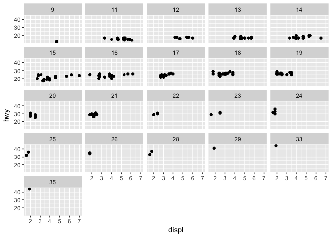
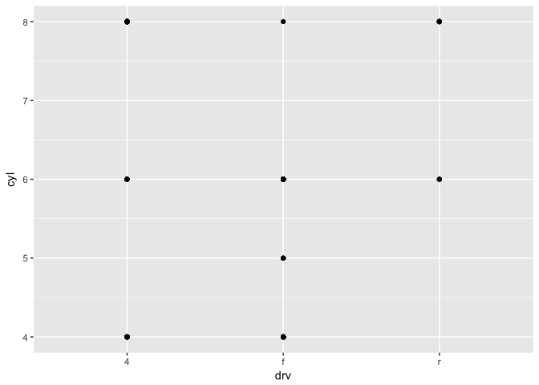
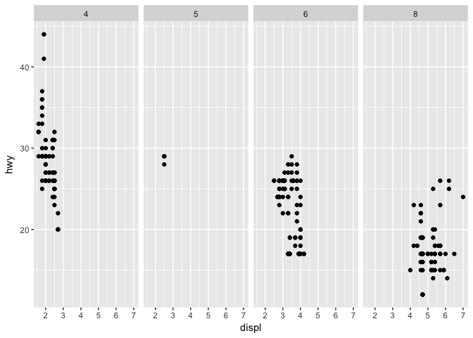
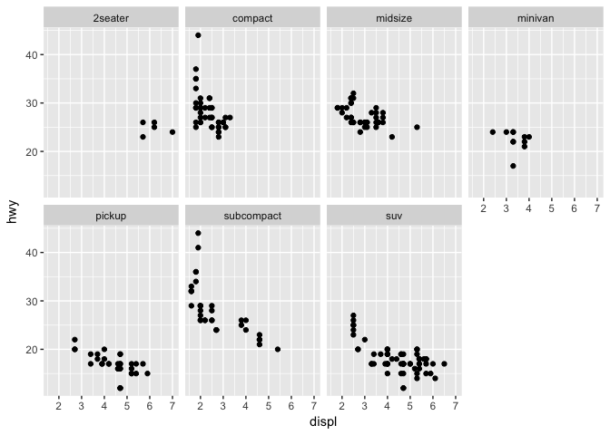

# Assignment_04_26_2017
Ruijuan Li  
4/26/2017  

# 3.2.4 Exercises
1)  

```r
library(ggplot2)
```

```
## Warning: package 'ggplot2' was built under R version 3.2.5
```

```r
ggplot(data = mpg)
```

<!-- -->

2) 

```r
nrow(mtcars)
```

```
## [1] 32
```

3) 

```r
?mpg
# drv: f = front-wheel drive, r = rear wheel drive, 4 = 4wd
```

4) 

```r
ggplot(data = mpg) + geom_point(mapping = aes(x=cyl, y = hwy))
```

<!-- -->

5) 

```r
ggplot(data = mpg) + geom_point(mapping = aes(x=class, y = drv))
```

<!-- -->

# 3.3.1 Exercieses
1) 

```r
ggplot(data = mpg) + 
  geom_point(mapping = aes(x = displ, y = hwy, color = "blue")) 
```

<!-- -->

```r
# because color is inside aes()
```

2) 

```r
summary(mpg)
```

```
##  manufacturer          model               displ            year     
##  Length:234         Length:234         Min.   :1.600   Min.   :1999  
##  Class :character   Class :character   1st Qu.:2.400   1st Qu.:1999  
##  Mode  :character   Mode  :character   Median :3.300   Median :2004  
##                                        Mean   :3.472   Mean   :2004  
##                                        3rd Qu.:4.600   3rd Qu.:2008  
##                                        Max.   :7.000   Max.   :2008  
##       cyl           trans               drv                 cty       
##  Min.   :4.000   Length:234         Length:234         Min.   : 9.00  
##  1st Qu.:4.000   Class :character   Class :character   1st Qu.:14.00  
##  Median :6.000   Mode  :character   Mode  :character   Median :17.00  
##  Mean   :5.889                                         Mean   :16.86  
##  3rd Qu.:8.000                                         3rd Qu.:19.00  
##  Max.   :8.000                                         Max.   :35.00  
##       hwy             fl               class          
##  Min.   :12.00   Length:234         Length:234        
##  1st Qu.:18.00   Class :character   Class :character  
##  Median :24.00   Mode  :character   Mode  :character  
##  Mean   :23.44                                        
##  3rd Qu.:27.00                                        
##  Max.   :44.00
```

```r
?mpg
# characters are categorical? numeric values are continuous? 
```

3) 

```r
# ggplot(data = mpg) + 
# #  geom_point(mapping = aes(x = displ, y = hwy, color = year)) 
# 
# ggplot(data = mpg) + 
#   geom_point(mapping = aes(x = displ, y = hwy, size = year))
# 
# ggplot(data = mpg) + 
#   geom_point(mapping = aes(x = displ, y = hwy, shape = year))
# 
# ggplot(data = mpg) + 
#   geom_point(mapping = aes(x = displ, y = hwy, color = class)) 
# 
# ggplot(data = mpg) + 
#   geom_point(mapping = aes(x = displ, y = hwy, size = class))
# 
# ggplot(data = mpg) + 
#   geom_point(mapping = aes(x = displ, y = hwy, shape = class)) 
```

4) 

```r
ggplot(data = mpg) + 
  geom_point(mapping = aes(x = displ, y = hwy, color = year, size = year)) 
```

<!-- -->

5)  

```r
?geom_point
ggplot(data = mpg) + 
  geom_point(mapping = aes(x = displ, y = hwy), stroke = 1)
```

<!-- -->

```r
ggplot(data = mpg) + 
  geom_point(mapping = aes(x = displ, y = hwy), stroke = 4)
```

<!-- -->

6) 

```r
ggplot(data = mpg) + 
  geom_point(mapping = aes(x = displ, y = hwy, color = displ < 5))
```

<!-- -->

# 3.5.1 Exercises 
1) 

```r
ggplot(data = mpg) + 
  geom_point(mapping = aes(x = displ, y = hwy)) + 
  facet_wrap( ~ cty) 
```

<!-- -->

2) 

```r
ggplot(data = mpg) + 
  geom_point(mapping = aes(x = displ, y = hwy)) + 
  facet_grid(drv ~ cyl) 
```

<!-- -->

```r
ggplot(data = mpg) + 
  geom_point(mapping = aes(x = drv, y = cyl)) 
```

<!-- -->

3) 

```r
ggplot(data = mpg) + 
  geom_point(mapping = aes(x = displ, y = hwy)) +
  facet_grid(drv ~ .)
```

<!-- -->

```r
ggplot(data = mpg) + 
  geom_point(mapping = aes(x = displ, y = hwy)) +
  facet_grid(. ~ cyl)
```

<!-- -->

```r
# . means ignore that dimention 
```

4) 

```r
ggplot(data = mpg) + 
  geom_point(mapping = aes(x = displ, y = hwy)) + 
  facet_wrap(~ class, nrow = 2)
```

<!-- -->

```r
# clearly show the pattern for each group as an advantage, cannot see the whole picture as an disadvantage  
```

5) 

```r
?facet_wrap
# facet_grid takes the number of groups in each dimention as the number of colomn and rows 
```

6) 

```r
# When using facet_grid() you should usually put the variable with more unique levels in the columns. Why? 
ggplot(data = mpg) + 
  geom_point(mapping = aes(x = displ, y = hwy)) +
  facet_grid(drv ~ cty)
```

<!-- -->

```r
ggplot(data = mpg) + 
  geom_point(mapping = aes(x = displ, y = hwy)) +
  facet_grid(cty ~ drv)
```

<!-- -->

```r
length(unique(mpg$drv))
```

```
## [1] 3
```

```r
length(unique(mpg$cty)) 
```

```
## [1] 21
```


