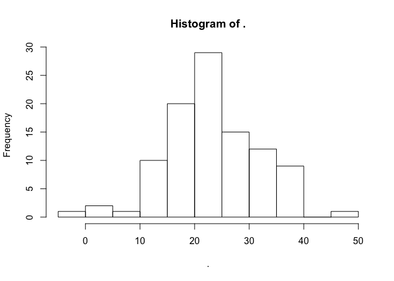

# Assignment_08_16_2017
Ruijuan Li  
8/16/2017  

### 19.2.1 Practice

1) Why is TRUE not a parameter to rescale01()? What would happen if x contained a single missing value, and na.rm was FALSE?

```r
rescale01 <- function(x) {
  rng <- range(x, na.rm = FALSE)
  (x - rng[1]) / (rng[2] - rng[1])
}

rescale01(c(1, 2, 3, NA, 5)) # all NAs
```

```
## [1] NA NA NA NA NA
```

2) In the second variant of rescale01(), infinite values are left unchanged. Rewrite rescale01() so that -Inf is mapped to 0, and Inf is mapped to 1.

```r
rescale01 <- function(x) {
  rng <- range(x, na.rm = TRUE, finite = TRUE)
  y <- (x - rng[1]) / (rng[2] - rng[1])
  y[y == -Inf] <- 0
  y[y == Inf] <- 1
  y
}

x <- c(1:10, -Inf, Inf)
rescale01(x) 
```

```
##  [1] 0.0000000 0.1111111 0.2222222 0.3333333 0.4444444 0.5555556 0.6666667
##  [8] 0.7777778 0.8888889 1.0000000 0.0000000 1.0000000
```

3) Practice turning the following code snippets into functions. Think about what each function does. What would you call it? How many arguments does it need? Can you rewrite it to be more expressive or less duplicative?


```r
mean(is.na(x))

x / sum(x, na.rm = TRUE)

sd(x, na.rm = TRUE) / mean(x, na.rm = TRUE)
```


```r
x <- c(1, 4, 7, NA, 9, 10, 12, 16)

perc.na <- function(x){
  mean(is.na(x))
}

perc.val <- function(x){
  x / sum(x, na.rm = TRUE)
}  

coeffi.var <- function(x){
  sd(x, na.rm = TRUE) / mean(x, na.rm = TRUE)
} 

perc.na(x)
```

```
## [1] 0.125
```

```r
perc.val(x)
```

```
## [1] 0.01694915 0.06779661 0.11864407         NA 0.15254237 0.16949153
## [7] 0.20338983 0.27118644
```

```r
coeffi.var(x)
```

```
## [1] 0.5926551
```

4) Follow http://nicercode.github.io/intro/writing-functions.html to write your own functions to compute the variance and skew of a numeric vector.


5) Write both_na(), a function that takes two vectors of the same length and returns the number of positions that have an NA in both vectors.

```r
both_na <- function(x, y){
  if(length(x) != length(y)){
    print("different length for the two vectors, exit!")
  } else {
    intersect(which(is.na(x)), which(is.na(y)))
  }
}

x <- c(1, 4, 7, NA, 9, 10, 12, 16, NA, NA)
y <- c(1, 4, 7, NA, 9, 10, 12, 16, NA, 12)
both_na(x, y)
```

```
## [1] 4 9
```

6) What do the following functions do? Why are they useful even though they are so short?


```r
is_directory <- function(x) file.info(x)$isdir # check to see whether x is a directory
is_readable <- function(x) file.access(x, 4) == 0 # check to see whether x is readable
```

7) Read the complete lyrics to “Little Bunny Foo Foo”. There’s a lot of duplication in this song. Extend the initial piping example to recreate the complete song, and use functions to reduce the duplication.

```r
# don't understand the question 
```

### 19.4.4 Exercises

1) What’s the difference between if and ifelse()? Carefully read the help and construct three examples that illustrate the key differences.

```r
?ifelse
# ifelse is an function itself, if is part of conditional execution  
x <- 1
ifelse(x > 0, T, F)
```

```
## [1] TRUE
```

2) Write a greeting function that says “good morning”, “good afternoon”, or “good evening”, depending on the time of day. (Hint: use a time argument that defaults to lubridate::now(). That will make it easier to test your function.)

```r
library(lubridate)
```

```
## Warning: package 'lubridate' was built under R version 3.2.5
```

```
## 
## Attaching package: 'lubridate'
```

```
## The following object is masked from 'package:base':
## 
##     date
```

```r
greeting <- function(time){
  hr <- hour(time)
  if(hr < 12) {
    print("good morning")
  } else if (hr < 17){
    print("good afternoon")
  } else {
    print("good evening")
  }
}

greeting(lubridate::now())
```

```
## [1] "good afternoon"
```

```r
# copy from https://jrnold.github.io/e4qf/functions.html#exercises-42 
```

3) Implement a fizzbuzz function. It takes a single number as input. If the number is divisible by three, it returns “fizz”. If it’s divisible by five it returns “buzz”. If it’s divisible by three and five, it returns “fizzbuzz”. Otherwise, it returns the number. Make sure you first write working code before you create the function.

```r
fizzbuzz <- function(x){
  if(x %% 3 == 0 && x %% 5 == 0){
    return("fizzbuzz")
  } else if(x %% 3 == 0){
    return("fizz")
  } else if(x %% 5 == 0){ 
    return("buzz")
  } else {
    return(x)
  }
}

fizzbuzz(19)
```

```
## [1] 19
```

```r
fizzbuzz(15)
```

```
## [1] "fizzbuzz"
```

```r
fizzbuzz(30)
```

```
## [1] "fizzbuzz"
```

```r
fizzbuzz(5)
```

```
## [1] "buzz"
```

4) How could you use cut() to simplify this set of nested if-else statements?

```r
library(tidyverse)
```

```
## Warning: package 'tidyverse' was built under R version 3.2.5
```

```
## Loading tidyverse: ggplot2
## Loading tidyverse: tibble
## Loading tidyverse: tidyr
## Loading tidyverse: readr
## Loading tidyverse: purrr
## Loading tidyverse: dplyr
```

```
## Warning: package 'ggplot2' was built under R version 3.2.5
```

```
## Warning: package 'tibble' was built under R version 3.2.5
```

```
## Warning: package 'tidyr' was built under R version 3.2.5
```

```
## Warning: package 'readr' was built under R version 3.2.5
```

```
## Warning: package 'purrr' was built under R version 3.2.5
```

```
## Warning: package 'dplyr' was built under R version 3.2.5
```

```
## Conflicts with tidy packages ----------------------------------------------
```

```
## as.difftime(): lubridate, base
## date():        lubridate, base
## filter():      dplyr, stats
## intersect():   lubridate, base
## lag():         dplyr, stats
## setdiff():     lubridate, base
## union():       lubridate, base
```

```r
# if (temp <= 0) {
#   "freezing"
# } else if (temp <= 10) {
#   "cold"
# } else if (temp <= 20) {
#   "cool"
# } else if (temp <= 30) {
#   "warm"
# } else {
#   "hot"
# }

temp <- rnorm(100, m=24, sd = 8) 
temp %>% hist()
```

<!-- -->

```r
?cut
cut(temp, breaks =c(-Inf, 0, 10, 20, 30, Inf), labels = c("freezing", "cold", "cool", "warm", "hot")) # copy & paste from https://jrnold.github.io/e4qf/functions.html#exercises-42
```

```
##   [1] warm     cool     warm     cool     warm     cool     hot     
##   [8] warm     cool     warm     hot      warm     warm     warm    
##  [15] freezing cold     cool     hot      warm     hot      cold    
##  [22] warm     warm     cool     cool     hot      hot      cool    
##  [29] cool     hot      cool     warm     warm     cool     warm    
##  [36] warm     cool     hot      cool     hot      warm     warm    
##  [43] cool     warm     warm     hot      cool     cool     hot     
##  [50] hot      cool     cool     hot      cool     warm     hot     
##  [57] warm     hot      warm     warm     warm     warm     cool    
##  [64] warm     hot      warm     warm     hot      warm     warm    
##  [71] hot      warm     warm     warm     cold     cool     warm    
##  [78] warm     warm     warm     hot      cool     cool     cool    
##  [85] hot      cool     warm     warm     warm     hot      warm    
##  [92] cool     cool     hot      cool     warm     warm     cool    
##  [99] cool     warm    
## Levels: freezing cold cool warm hot
```

```r
# if < was used instead of <=
cut(20, breaks =c(-Inf, 0, 10, 20, 30, Inf), labels = c("freezing", "cold", "cool", "warm", "hot"), right = F)
```

```
## [1] warm
## Levels: freezing cold cool warm hot
```
How would you change the call to cut() if I’d used < instead of <=? What is the other chief advantage of cut() for this problem? (Hint: what happens if you have many values in temp?)

5) What happens if you use switch() with numeric values?

```r
?switch
require(stats)
centre <- function(x, type) {
  switch(type,
         mean = mean(x),
         median = median(x),
         trimmed = mean(x, trim = .1)) # don't understand this trim option 
}

?mean

x <- rcauchy(10)
x
```

```
##  [1]  2.5382301  2.4183788 -0.4158015  1.0543059  1.2063303  0.2711538
##  [7]  2.4319877  0.1063720  1.3840202  0.9519430
```

```r
centre(x, "mean")
```

```
## [1] 1.194692
```

```r
centre(x, "median")
```

```
## [1] 1.130318
```

```r
centre(x, "trimmed")
```

```
## [1] 1.228061
```

```r
mean(x)
```

```
## [1] 1.194692
```

```r
mean(c(1.1, 3, 4), trim = .1)
```

```
## [1] 2.7
```

```r
mean(c(1.1, 3, 4))
```

```
## [1] 2.7
```

```r
switch(2, "one", "two", "three")
```

```
## [1] "two"
```

6) What does this switch() call do? What happens if x is “e”?

```r
tmp_function <- function(x){
  switch(x, 
    a = ,
    b = "ab",
    c = ,
    d = "cd"
  )
} 

tmp_function("a")
```

```
## [1] "ab"
```

```r
tmp_function("b")
```

```
## [1] "ab"
```

```r
tmp_function("c")
```

```
## [1] "cd"
```

```r
tmp_function("d")
```

```
## [1] "cd"
```

```r
tmp_function("e")
```
Experiment, then carefully read the documentation.


