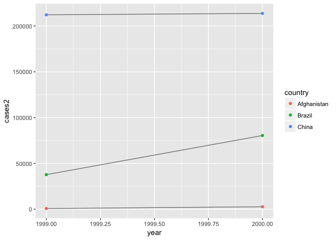

# Assignment_06_14_2017
Ruijuan Li  
6/14/2017  

# 12.2.1 Exercises

1. Using prose, describe how the variables and observations are organised in each of the sample tables.

```r
# skipped 
```

2. Compute the rate for table2, and table4a + table4b. You will need to perform four operations:

      1. Extract the number of TB cases per country per year.

      2. Extract the matching population per country per year.
  
      3. Divide cases by population, and multiply by 10000.

      4. Store back in the appropriate place.

    Which representation is easiest to work with? Which is hardest? Why?
    

```r
library("tidyverse")
```

```
## Loading tidyverse: ggplot2
## Loading tidyverse: tibble
## Loading tidyverse: tidyr
## Loading tidyverse: readr
## Loading tidyverse: purrr
## Loading tidyverse: dplyr
```

```
## Conflicts with tidy packages ----------------------------------------------
```

```
## filter(): dplyr, stats
## lag():    dplyr, stats
```

```r
library("reshape2")
```

```
## 
## Attaching package: 'reshape2'
```

```
## The following object is masked from 'package:tidyr':
## 
##     smiths
```

```r
# table 2 
cases <- 
table2 %>%
  filter(type == "cases") %>%
  select(count)

population <- 
table2 %>%
  filter(type == "population") %>%
  select(count)

country <- filter(table2, type == "cases")[["country"]]
year <- filter(table2, type == "cases")[["year"]]

table2_clean <- tibble(country = country,
       year = year,
       cases2 = cases$count,
       population2 = population$count,
       rate = cases$count / population$count * 1000)
table2_clean
```

```
## # A tibble: 6 × 5
##       country  year cases2 population2      rate
##         <chr> <int>  <int>       <int>     <dbl>
## 1 Afghanistan  1999    745    19987071 0.0372741
## 2 Afghanistan  2000   2666    20595360 0.1294466
## 3      Brazil  1999  37737   172006362 0.2193930
## 4      Brazil  2000  80488   174504898 0.4612363
## 5       China  1999 212258  1272915272 0.1667495
## 6       China  2000 213766  1280428583 0.1669488
```

```r
# table4a; table4b
table4a.melt <- melt(table4a) # cases value 
```

```
## Using country as id variables
```

```r
table4b.melt <- melt(table4b) # population value 
```

```
## Using country as id variables
```

```r
table4ab <- 
merge(table4a.melt, table4b.melt, by="country") %>%
  select(country, variable.x, value.x, value.y) %>%
  mutate(value.x / value.y * 10000)
colnames(table4ab) <- c("country", "year", "cases", "population", "rate")
head(table4ab)
```

```
##       country year cases population     rate
## 1 Afghanistan 1999   745   19987071 0.372741
## 2 Afghanistan 1999   745   20595360 0.361732
## 3 Afghanistan 2000  2666   19987071 1.333862
## 4 Afghanistan 2000  2666   20595360 1.294466
## 5      Brazil 1999 37737  172006362 2.193930
## 6      Brazil 1999 37737  174504898 2.162518
```

3. Recreate the plot showing change in cases over time using table2 instead of table1. What do you need to do first?

```r
library(ggplot2)
ggplot(table1, aes(year, cases)) + 
  geom_line(aes(group = country), colour = "grey50") + 
  geom_point(aes(colour = country))
```

<!-- -->

```r
ggplot(table2_clean, aes(year, cases2)) + 
  geom_line(aes(group = country), colour = "grey50") + 
  geom_point(aes(colour = country))
```

<!-- -->

# 12.3.3 Exercises

1. Why are gather() and spread() not perfectly symmetrical?
      Carefully consider the following example:


```r
stocks <- tibble(
  year   = c(2015, 2015, 2016, 2016),
  half  = c(   1,    2,     1,    2),
  return = c(1.88, 0.59, 0.92, 0.17)
)
stocks
```

```
## # A tibble: 4 × 3
##    year  half return
##   <dbl> <dbl>  <dbl>
## 1  2015     1   1.88
## 2  2015     2   0.59
## 3  2016     1   0.92
## 4  2016     2   0.17
```

```r
stocks %>% 
  spread(year, return) %>% 
  gather("year", "return", `2015`:`2016`) 
```

```
## # A tibble: 4 × 3
##    half  year return
##   <dbl> <chr>  <dbl>
## 1     1  2015   1.88
## 2     2  2015   0.59
## 3     1  2016   0.92
## 4     2  2016   0.17
```

      (Hint: look at the variable types and think about column names.)

      Both spread() and gather() have a convert argument. What does it do?

The functions spread and gather are not perfectly symmetrical because column type information is not transferred between them. In the original table the column year was numeric, but after the spread-gather cyle it is character, because with gather, variable names are always converted to a character vector. (copied from https://jrnold.github.io/e4qf/tidy-data.html) 

2. Why does this code fail?


```r
# table4a %>% 
#  gather(1999, 2000, key = "year", value = "cases")
#> Error in combine_vars(vars, ind_list): Position must be between 0 and n

table4a %>% 
  gather(`1999`, `2000`, key = "year", value = "cases")
```

```
## # A tibble: 6 × 3
##       country  year  cases
##         <chr> <chr>  <int>
## 1 Afghanistan  1999    745
## 2      Brazil  1999  37737
## 3       China  1999 212258
## 4 Afghanistan  2000   2666
## 5      Brazil  2000  80488
## 6       China  2000 213766
```

3. Why does spreading this tibble fail? How could you add a new column to fix the problem? 


```r
# people <- tribble(
#   ~name,             ~key,    ~value,
#   #-----------------|--------|------
#   "Phillip Woods",   "age",       45,
#   "Phillip Woods",   "height",   186,
#   "Phillip Woods",   "age",       50,
#   "Jessica Cordero", "age",       37,
#   "Jessica Cordero", "height",   156
# )

# spread(people, key, value)
#> Error: Duplicate identifiers for rows (1, 3) 

people <- tribble(
  ~name,             ~key,    ~value, ~obs,
  #-----------------|--------|------|------
  "Phillip Woods",   "age",       45, 1,
  "Phillip Woods",   "height",   186, 1,
  "Phillip Woods",   "age",       50, 2,
  "Jessica Cordero", "age",       37, 1,
  "Jessica Cordero", "height",   156, 1
)

spread(people, key, value)
```

```
## # A tibble: 3 × 4
##              name   obs   age height
## *           <chr> <dbl> <dbl>  <dbl>
## 1 Jessica Cordero     1    37    156
## 2   Phillip Woods     1    45    186
## 3   Phillip Woods     2    50     NA
```

4. Tidy the simple tibble below. Do you need to spread or gather it? What are the variables?


```r
preg <- tribble(
  ~pregnant, ~male, ~female,
  "yes",     NA,    10,
  "no",      20,    12
)

preg
```

```
## # A tibble: 2 × 3
##   pregnant  male female
##      <chr> <dbl>  <dbl>
## 1      yes    NA     10
## 2       no    20     12
```

```r
gather(preg, sex, count, male, female) 
```

```
## # A tibble: 4 × 3
##   pregnant    sex count
##      <chr>  <chr> <dbl>
## 1      yes   male    NA
## 2       no   male    20
## 3      yes female    10
## 4       no female    12
```

# 12.4.3 Exercises

1. What do the extra and fill arguments do in separate()? Experiment with the various options for the following two toy datasets.


```r
tibble(x = c("a,b,c", "d,e,f,g", "h,i,j")) %>% 
  separate(x, c("one", "two", "three"))
```

```
## # A tibble: 3 × 3
##     one   two three
## * <chr> <chr> <chr>
## 1     a     b     c
## 2     d     e     f
## 3     h     i     j
```

```r
tibble(x = c("a,b,c", "d,e", "f,g,i")) %>% 
  separate(x, c("one", "two", "three"))
```

```
## # A tibble: 3 × 3
##     one   two three
## * <chr> <chr> <chr>
## 1     a     b     c
## 2     d     e  <NA>
## 3     f     g     i
```

```r
tibble(x = c("a,b,c", "d,e,f,g", "h,i,j")) %>% 
  separate(x, c("one", "two", "three"), extra="drop")
```

```
## # A tibble: 3 × 3
##     one   two three
## * <chr> <chr> <chr>
## 1     a     b     c
## 2     d     e     f
## 3     h     i     j
```

```r
tibble(x = c("a,b,c", "d,e,f,g", "h,i,j")) %>% 
  separate(x, c("one", "two", "three"), extra="merge")
```

```
## # A tibble: 3 × 3
##     one   two three
## * <chr> <chr> <chr>
## 1     a     b     c
## 2     d     e   f,g
## 3     h     i     j
```

```r
tibble(x = c("a,b,c", "d,e", "f,g,i")) %>% 
  separate(x, c("one", "two", "three"), fill="right")
```

```
## # A tibble: 3 × 3
##     one   two three
## * <chr> <chr> <chr>
## 1     a     b     c
## 2     d     e  <NA>
## 3     f     g     i
```

```r
tibble(x = c("a,b,c", "d,e", "f,g,i")) %>% 
  separate(x, c("one", "two", "three"), fill="left")
```

```
## # A tibble: 3 × 3
##     one   two three
## * <chr> <chr> <chr>
## 1     a     b     c
## 2  <NA>     d     e
## 3     f     g     i
```

2. Both unite() and separate() have a remove argument. What does it do? Why would you set it to FALSE?

```r
?unite

mtcars %>%
  unite(vs_am, vs, am) %>%
  separate(vs_am, c("vs", "am"), remove=T) %>% # remove vs_am 
  colnames
```

```
##  [1] "mpg"  "cyl"  "disp" "hp"   "drat" "wt"   "qsec" "vs"   "am"   "gear"
## [11] "carb"
```

```r
mtcars %>%
  unite(vs_am, vs, am) %>%
  separate(vs_am, c("vs", "am"), remove=F) %>% # don't remove vs_am 
  colnames
```

```
##  [1] "mpg"   "cyl"   "disp"  "hp"    "drat"  "wt"    "qsec"  "vs_am"
##  [9] "vs"    "am"    "gear"  "carb"
```

Compare and contrast separate() and extract(). Why are there three variations of separation (by position, by separator, and with groups), but only one unite?

```r
?extract
```

```
## Help on topic 'extract' was found in the following packages:
## 
##   Package               Library
##   tidyr                 /Library/Frameworks/R.framework/Versions/3.2/Resources/library
##   magrittr              /Library/Frameworks/R.framework/Versions/3.2/Resources/library
## 
## 
## Using the first match ...
```

```r
df <- data.frame(x = c(NA, "a-b", "a-d", "b-c", "d-e"))
df
```

```
##      x
## 1 <NA>
## 2  a-b
## 3  a-d
## 4  b-c
## 5  d-e
```

```r
df %>% extract(x, "A")
```

```
##      A
## 1 <NA>
## 2    a
## 3    a
## 4    b
## 5    d
```

```r
df %>% extract(x, c("A", "B"), "([[:alnum:]]+)-([[:alnum:]]+)")
```

```
##      A    B
## 1 <NA> <NA>
## 2    a    b
## 3    a    d
## 4    b    c
## 5    d    e
```

```r
df %>% extract(x, c("A", "B"), "([a-d]+)-([a-d]+)")
```

```
##      A    B
## 1 <NA> <NA>
## 2    a    b
## 3    a    d
## 4    b    c
## 5 <NA> <NA>
```

In unite it is unambigous since it is many columns to one, and once the columns are specified, there is only one way to do it, the only choice is the sep. In separate, it is one to many, and there are multiple ways to split the character string.


