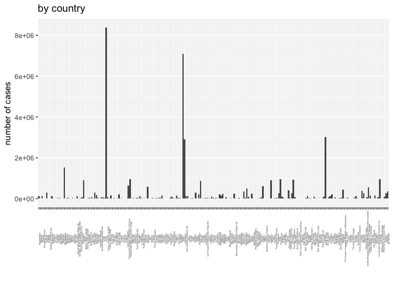

# R-club-Jun-21
Ruijuan Li  
6/21/2017  

# 12.5.1 Exercises

      1. Compare and contrast the fill arguments to spread() and complete().

```r
library("tidyverse")
```

```
## Loading tidyverse: ggplot2
## Loading tidyverse: tibble
## Loading tidyverse: tidyr
## Loading tidyverse: readr
## Loading tidyverse: purrr
## Loading tidyverse: dplyr
```

```
## Conflicts with tidy packages ----------------------------------------------
```

```
## filter(): dplyr, stats
## lag():    dplyr, stats
```

```r
?spread
stocks <- tibble(
  year   = c(2015, 2015, 2015, 2015, 2016, 2016, 2016),
  qtr    = c(   1,    2,    3,    4,    2,    3,    4),
  return = c(1.88, 0.59, 0.35,   NA, 0.92, 0.17, 2.66)
)

stocks %>% 
  spread(key = year, value = return, fill = "missing")
```

```
## # A tibble: 4 × 3
##     qtr  `2015`  `2016`
## * <dbl>   <chr>   <chr>
## 1     1    1.88 missing
## 2     2    0.59    0.92
## 3     3    0.35    0.17
## 4     4 missing    2.66
```

```r
# fill: If set, missing values will be replaced with this value. Note that there are two types of missingness in the input: explicit missing values (i.e. NA), and implicit missings, rows that simply aren't present. Both types of missing value will be replaced by fill. 

?complete
stocks %>% 
  complete(year, qtr) 
```

```
## # A tibble: 8 × 3
##    year   qtr return
##   <dbl> <dbl>  <dbl>
## 1  2015     1   1.88
## 2  2015     2   0.59
## 3  2015     3   0.35
## 4  2015     4     NA
## 5  2016     1     NA
## 6  2016     2   0.92
## 7  2016     3   0.17
## 8  2016     4   2.66
```

```r
# complete() takes a set of columns, and finds all unique combinations (here it is year * qtr). It then ensures the original dataset contains all those values, filling in explicit NAs where necessary.

stocks %>% 
  complete(year, qtr, fill = list(return = 1)) 
```

```
## # A tibble: 8 × 3
##    year   qtr return
##   <dbl> <dbl>  <dbl>
## 1  2015     1   1.88
## 2  2015     2   0.59
## 3  2015     3   0.35
## 4  2015     4   1.00
## 5  2016     1   1.00
## 6  2016     2   0.92
## 7  2016     3   0.17
## 8  2016     4   2.66
```

```r
# fill: A named list that for each variable supplies a single value to use instead of NA for missing combinations.
```

      2. What does the direction argument to fill() do?

```r
?fill
```

```
## Help on topic 'fill' was found in the following packages:
## 
##   Package               Library
##   tidyr                 /Library/Frameworks/R.framework/Versions/3.2/Resources/library
##   ggplot2               /Library/Frameworks/R.framework/Versions/3.2/Resources/library
## 
## 
## Using the first match ...
```

```r
df <- data.frame(Month = 1:12, Year = c(2000, rep(NA, 11)))
df
```

```
##    Month Year
## 1      1 2000
## 2      2   NA
## 3      3   NA
## 4      4   NA
## 5      5   NA
## 6      6   NA
## 7      7   NA
## 8      8   NA
## 9      9   NA
## 10    10   NA
## 11    11   NA
## 12    12   NA
```

```r
df %>% fill(Year, .direction="up") # fill from the present to its upward
```

```
##    Month Year
## 1      1 2000
## 2      2   NA
## 3      3   NA
## 4      4   NA
## 5      5   NA
## 6      6   NA
## 7      7   NA
## 8      8   NA
## 9      9   NA
## 10    10   NA
## 11    11   NA
## 12    12   NA
```

```r
df %>% fill(Year, .direction="down") # fill from the present to its downward
```

```
##    Month Year
## 1      1 2000
## 2      2 2000
## 3      3 2000
## 4      4 2000
## 5      5 2000
## 6      6 2000
## 7      7 2000
## 8      8 2000
## 9      9 2000
## 10    10 2000
## 11    11 2000
## 12    12 2000
```

# 12.6.1 Exercises

      1. In this case study I set na.rm = TRUE just to make it easier to check that we had the correct values. Is this reasonable? Think about how missing values are represented in this dataset. Are there implicit missing values? What’s the difference between an NA and zero?

```r
# in case study 
who1 <- who %>% 
  gather(new_sp_m014:newrel_f65, key = "key", value = "cases", na.rm = TRUE)
dim(who1) # 76046     6 
```

```
## [1] 76046     6
```

```r
# here 
who1.1 <- who %>% 
  gather(new_sp_m014:newrel_f65, key = "key", value = "cases")
head(who1.1)
```

```
## # A tibble: 6 × 6
##       country  iso2  iso3  year         key cases
##         <chr> <chr> <chr> <int>       <chr> <int>
## 1 Afghanistan    AF   AFG  1980 new_sp_m014    NA
## 2 Afghanistan    AF   AFG  1981 new_sp_m014    NA
## 3 Afghanistan    AF   AFG  1982 new_sp_m014    NA
## 4 Afghanistan    AF   AFG  1983 new_sp_m014    NA
## 5 Afghanistan    AF   AFG  1984 new_sp_m014    NA
## 6 Afghanistan    AF   AFG  1985 new_sp_m014    NA
```

```r
dim(who1.1) # 405440      6 
```

```
## [1] 405440      6
```

```r
who1.1 %>% 
  complete(country, year, key) %>%
  dim() #  416976      6 
```

```
## [1] 416976      6
```

```r
# YES, there are implicit missing values 

# missing vlaues means from specific country, year, and case(combined by case type, sex & age group), there is no data available. Zero mean the data value is zero. The data is what?  
```

      2. What happens if you neglect the mutate() step? (mutate(key = stringr::str_replace(key, "newrel", "new_rel"))) 

```r
# in case study 
# 1) collapse values into variables  
# 2) explore the data & understand the data structure
# 3) make consistent value names 
who2 <- who1 %>% 
  mutate(key = stringr::str_replace(key, "newrel", "new_rel"))

# 4) seperate key to different variables 
who3 <- who2 %>% 
  separate(key, c("new", "type", "sexage"), sep = "_")

# 5) explore & drop repeated & constant variables 
who3 %>% 
  count(new) 
```

```
## # A tibble: 1 × 2
##     new     n
##   <chr> <int>
## 1   new 76046
```

```r
who4 <- who3 %>% 
  select(-new, -iso2, -iso3)

# 6) seprate sex & age into different variables 
who5 <- who4 %>% 
  separate(sexage, c("sex", "age"), sep = 1) 

# tidy data!!! 

# if neglect step 3) 
# who5.1 <- 
#   who %>%
#   gather(code, value, new_sp_m014:newrel_f65, na.rm = TRUE) %>% 
#   separate(code, c("new", "var", "sexage")) %>% 
#   select(-new, -iso2, -iso3) %>% 
#   separate(sexage, c("sex", "age"), sep = 1) 

# Warning message:
# Too few values at 2580 locations: 73467, 73468, 73469, 73470, 73471, 73472, 73473, 73474, 73475, 73476, 73477, 73478, 73479, 73480, 73481, 73482, 73483, 73484, 73485, 73486, ...  
```

      3. I claimed that iso2 and iso3 were redundant with country. Confirm this claim. 

```r
who1.1 %>% 
  complete(country, year, key) %>%
  dim()
```

```
## [1] 416976      6
```

```r
who1.1 %>% 
  complete(iso2, year, key) %>%
  dim()
```

```
## [1] 416976      6
```

```r
who1.1 %>% 
  complete(iso3, year, key) %>%
  dim() 
```

```
## [1] 416976      6
```

      4. For each country, year, and sex compute the total number of cases of TB. Make an informative visualisation of the data.

```r
country_cases <- 
  who5 %>%
  count(country, wt=cases)

year_cases <- 
  who5 %>%
  count(year, wt=cases)

sex_cases <- 
  who5 %>%
  count(sex, wt=cases)

p.by.country <- ggplot(data = country_cases, mapping = aes(x=country, y=n)) + geom_col() + theme(axis.text.x = element_text(angle = 90, size = 3), legend.position = "none") + labs(list(title = "", x = "", y = "number of cases"))

p.by.year <- ggplot(data = year_cases, mapping = aes(x=year, y=n)) + geom_col() + theme(axis.text.x = element_text(angle = 90, size = 6), legend.position = "none") + labs(list(title = "", x = "", y = "number of cases"))

p.by.sex <- ggplot(data = sex_cases, mapping = aes(x=sex, y=n)) + geom_col() + theme(axis.text.x = element_text(angle = 90, size = 15), legend.position = "none") + labs(list(title = "", x = "", y = "number of cases"))

library(cowplot)
```

```
## Warning: package 'cowplot' was built under R version 3.2.5
```

```
## Warning: `legend.margin` must be specified using `margin()`. For the old
## behavior use legend.spacing
```

```
## 
## Attaching package: 'cowplot'
```

```
## The following object is masked from 'package:ggplot2':
## 
##     ggsave
```

```r
p.all <- plot_grid(
  p.by.country +labs(title="by country")+theme(legend.position = "none"),
  p.by.year +labs(title="by year") +theme(legend.position = "none"),
  p.by.sex +labs(title="by sex") +theme(legend.position = "none"),
  align = 'vh', ncol=1, nrow = 3, labels=c("",""))
```

```
## Warning: `panel.margin` is deprecated. Please use `panel.spacing` property
## instead
```

```r
p.all
```

<!-- -->

# 13.2.1 Exercises

      1. Imagine you wanted to draw (approximately) the route each plane flies from its origin to its destination. What variables would you need? What tables would you need to combine?

```r
# flights$origin & flights$dest
# flights & airport  
```

      2. I forgot to draw the relationship between weather and airports. What is the relationship and how should it appear in the diagram?

```r
library(nycflights13)
```

```
## Warning: package 'nycflights13' was built under R version 3.2.5
```

```r
colnames(weather)
```

```
##  [1] "origin"     "year"       "month"      "day"        "hour"      
##  [6] "temp"       "dewp"       "humid"      "wind_dir"   "wind_speed"
## [11] "wind_gust"  "precip"     "pressure"   "visib"      "time_hour"
```

```r
colnames(airports)
```

```
## [1] "faa"   "name"  "lat"   "lon"   "alt"   "tz"    "dst"   "tzone"
```

```r
colnames(flights)
```

```
##  [1] "year"           "month"          "day"            "dep_time"      
##  [5] "sched_dep_time" "dep_delay"      "arr_time"       "sched_arr_time"
##  [9] "arr_delay"      "carrier"        "flight"         "tailnum"       
## [13] "origin"         "dest"           "air_time"       "distance"      
## [17] "hour"           "minute"         "time_hour"
```

```r
# origin is the common column for weather & airport 
```

      3. weather only contains information for the origin (NYC) airports. If it contained weather records for all airports in the USA, what additional relation would it define with flights?

```r
colnames(flights)
```

```
##  [1] "year"           "month"          "day"            "dep_time"      
##  [5] "sched_dep_time" "dep_delay"      "arr_time"       "sched_arr_time"
##  [9] "arr_delay"      "carrier"        "flight"         "tailnum"       
## [13] "origin"         "dest"           "air_time"       "distance"      
## [17] "hour"           "minute"         "time_hour"
```

```r
# dest?  
```

      4. We know that some days of the year are “special”, and fewer people than usual fly on them. How might you represent that data as a data frame? What would be the primary keys of that table? How would it connect to the existing tables?

```r
# month & day would be the primary key (concept of primary key), it connect to flights with column "month" & "day" 
# representation of that data frame eg: month day average_passenger_number_in_10_years  
```

