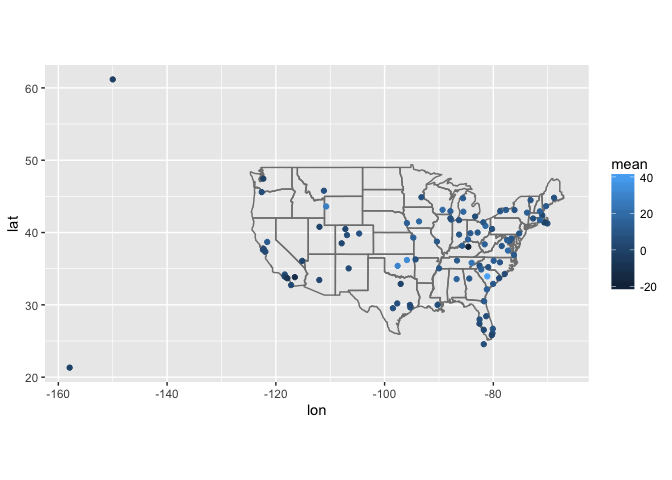
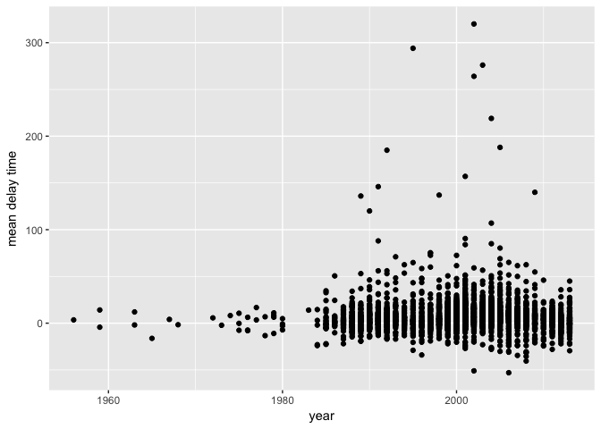
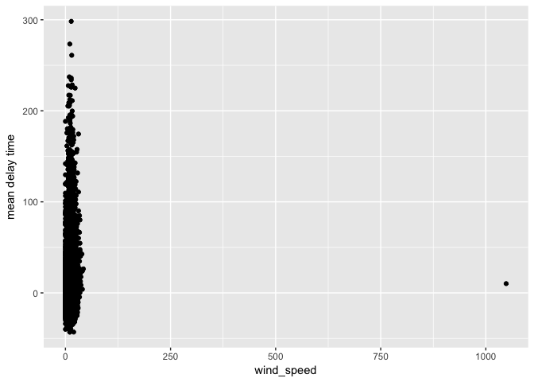
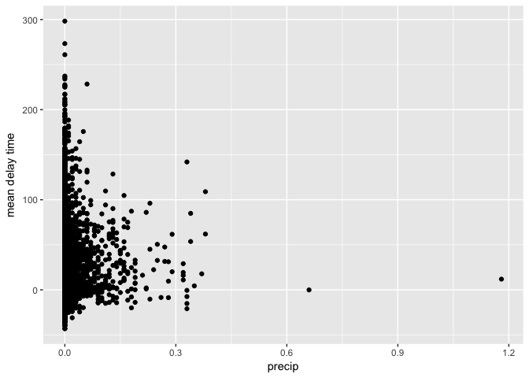
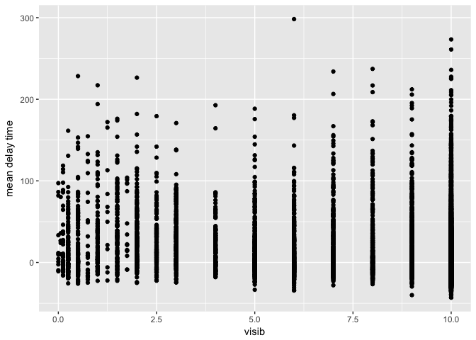
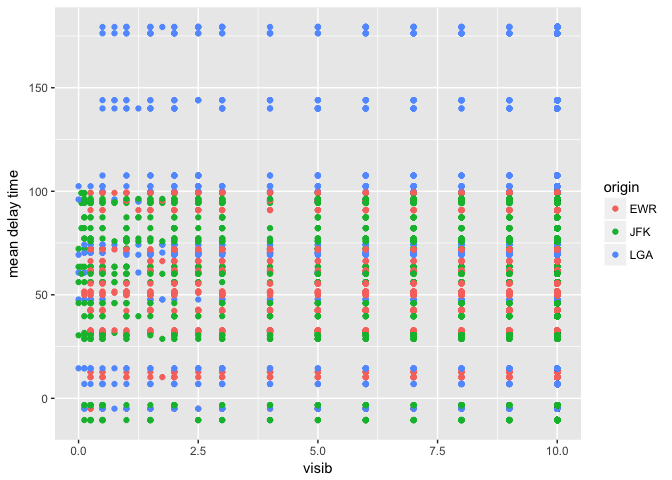

# Assignment_06_28_2017
Ruijuan Li  
7/14/2017  

# 13.3.1 Exercises

1. Add a surrogate key to flights.

```r
library(tidyverse)
```

```
## Warning: package 'tidyverse' was built under R version 3.2.5
```

```
## Loading tidyverse: ggplot2
## Loading tidyverse: tibble
## Loading tidyverse: tidyr
## Loading tidyverse: readr
## Loading tidyverse: purrr
## Loading tidyverse: dplyr
```

```
## Warning: package 'ggplot2' was built under R version 3.2.5
```

```
## Warning: package 'tibble' was built under R version 3.2.5
```

```
## Warning: package 'tidyr' was built under R version 3.2.5
```

```
## Warning: package 'readr' was built under R version 3.2.5
```

```
## Warning: package 'purrr' was built under R version 3.2.5
```

```
## Warning: package 'dplyr' was built under R version 3.2.5
```

```
## Conflicts with tidy packages ----------------------------------------------
```

```
## filter(): dplyr, stats
## lag():    dplyr, stats
```

```r
library(nycflights13)
```

```
## Warning: package 'nycflights13' was built under R version 3.2.5
```

```r
flights_2 <- 
flights %>%
  mutate(key = row_number(flights$month)) 
```

2. Identify the keys in the following datasets

      1. Lahman::Batting,
      2. babynames::babynames
      3. nasaweather::atmos
      4. fueleconomy::vehicles
      5. ggplot2::diamonds
      (You might need to install some packages and read some documentation.)
      

```r
library(Lahman)
```

```
## Warning: package 'Lahman' was built under R version 3.2.5
```

```r
library(babynames)
```

```
## Warning: package 'babynames' was built under R version 3.2.5
```

```r
library(nasaweather)
library(fueleconomy)

?Batting # no primary key 
keyID <- which(lapply(colnames(Batting), function(x) {Batting %>% count(Batting[,x]) %>% select(n) %>% unique() %>% nrow()}) %>% unlist() == 1)
colnames(Batting)[keyID]
```

```
## character(0)
```

```r
?babynames
colnames(babynames)
```

```
## [1] "year" "sex"  "name" "n"    "prop"
```

```r
head(babynames)
```

```
## # A tibble: 6 × 5
##    year   sex      name     n       prop
##   <dbl> <chr>     <chr> <int>      <dbl>
## 1  1880     F      Mary  7065 0.07238433
## 2  1880     F      Anna  2604 0.02667923
## 3  1880     F      Emma  2003 0.02052170
## 4  1880     F Elizabeth  1939 0.01986599
## 5  1880     F    Minnie  1746 0.01788861
## 6  1880     F  Margaret  1578 0.01616737
```

```r
babynames %>% 
  count(year, sex, name) %>%
  filter(nn > 1)
```

```
## Source: local data frame [0 x 4]
## Groups: year, sex [0]
## 
## # ... with 4 variables: year <dbl>, sex <chr>, name <chr>, nn <int>
```

```r
?atmos
atmos %>% 
  count(lat, long, year, month) %>%
  filter(n > 1)
```

```
## Source: local data frame [0 x 5]
## Groups: lat, long, year [0]
## 
## # ... with 5 variables: lat <dbl>, long <dbl>, year <int>, month <int>,
## #   n <int>
```

```r
?vehicles
vehicles %>%
  count(id) %>%
  filter(n > 1)
```

```
## # A tibble: 0 × 2
## # ... with 2 variables: id <int>, n <int>
```

```r
?diamonds
diamonds %>%
  count(carat, cut, color, clarity, x, y, z, depth, table, price) %>%
  filter(n > 1)
```

```
## Source: local data frame [143 x 11]
## Groups: carat, cut, color, clarity, x, y, z, depth, table [143]
## 
##    carat       cut color clarity     x     y     z depth table price     n
##    <dbl>     <ord> <ord>   <ord> <dbl> <dbl> <dbl> <dbl> <dbl> <int> <int>
## 1   0.30      Good     J     VS1  4.23  4.26  2.69  63.4    57   394     2
## 2   0.30 Very Good     G     VS2  4.29  4.31  2.71  63.0    55   526     2
## 3   0.30 Very Good     J     VS1  4.26  4.23  2.69  63.4    57   506     2
## 4   0.30   Premium     D     SI1  4.31  4.28  2.67  62.2    58   709     2
## 5   0.30     Ideal     G     VS2  4.31  4.29  2.71  63.0    55   675     2
## 6   0.30     Ideal     G      IF  4.32  4.35  2.69  62.1    55   863     2
## 7   0.30     Ideal     H     SI1  4.26  4.29  2.66  62.2    57   450     2
## 8   0.30     Ideal     H     SI1  4.27  4.28  2.66  62.2    57   450     2
## 9   0.31      Good     D     SI1  4.29  4.31  2.73  63.5    56   571     2
## 10  0.31 Very Good     D     SI1  4.31  4.29  2.73  63.5    56   732     2
## # ... with 133 more rows
```

```r
# no key 
```

3. Draw a diagram illustrating the connections between the Batting, Master, and Salaries tables in the Lahman package. Draw another diagram that shows the relationship between Master, Managers, AwardsManagers.

How would you characterise the relationship between the Batting, Pitching, and Fielding tables?

```r
# From Julin
# devtools::install_github("bergant/datamodelr")
# library(datamodelr) 
# https://github.com/bergant/datamodelr 
```

# 13.4.6 Exercises

1. Compute the average delay by destination, then join on the airports data frame so you can show the spatial distribution of delays. Here’s an easy way to draw a map of the United States:


```r
airports %>%
  semi_join(flights, c("faa" = "dest")) %>%
  ggplot(aes(lon, lat)) +
    borders("state") +
    geom_point() +
    coord_quickmap()
```

```
## Warning: package 'maps' was built under R version 3.2.5
```

```
## 
## Attaching package: 'maps'
```

```
## The following object is masked from 'package:purrr':
## 
##     map
```

<!-- -->

(Don’t worry if you don’t understand what semi_join() does — you’ll learn about it next.)

You might want to use the size or colour of the points to display the average delay for each airport.

```r
flights %>%
  group_by(dest) %>%
  summarise(mean = mean(arr_delay, na.rm = TRUE)) %>%
  inner_join(airports, c("dest"="faa")) %>%
  ggplot(aes(lon, lat, color=mean)) +
    borders("state") +
    geom_point() +
    coord_quickmap() 
```

<!-- -->

2. Add the location of the origin and destination (i.e. the lat and lon) to flights.

```r
flights %>%
  left_join(airports, c("dest"="faa")) %>%
  colnames() 
```

```
##  [1] "year"           "month"          "day"            "dep_time"      
##  [5] "sched_dep_time" "dep_delay"      "arr_time"       "sched_arr_time"
##  [9] "arr_delay"      "carrier"        "flight"         "tailnum"       
## [13] "origin"         "dest"           "air_time"       "distance"      
## [17] "hour"           "minute"         "time_hour"      "name"          
## [21] "lat"            "lon"            "alt"            "tz"            
## [25] "dst"            "tzone"
```

3. Is there a relationship between the age of a plane and its delays?

```r
flights %>%
  group_by(tailnum) %>%
  summarise(mean = mean(arr_delay, na.rm=T)) %>%
  inner_join(planes, by="tailnum") %>%
  ggplot(aes(year, mean)) + 
  geom_point() + 
  labs(x="year", y="mean delay time") 
```

```
## Warning: Removed 76 rows containing missing values (geom_point).
```

<!-- -->

4. What weather conditions make it more likely to see a delay?

```r
flights %>% 
  group_by(year, month, day, hour, origin) %>%
  summarise(mean = mean(arr_delay, na.rm=T)) %>% 
  inner_join(weather) %>%
  ggplot(aes(wind_speed, mean)) + 
  geom_point() + 
  labs(x="wind_speed", y="mean delay time") 
```

```
## Joining, by = c("year", "month", "day", "hour", "origin")
```

```
## Warning: Removed 57 rows containing missing values (geom_point).
```

<!-- -->

```r
flights %>% 
  group_by(year, month, day, hour, origin) %>%
  summarise(mean = mean(arr_delay, na.rm=T)) %>% 
  inner_join(weather) %>%
  ggplot(aes(precip, mean)) + 
  geom_point() + 
  labs(x="precip", y="mean delay time") 
```

```
## Joining, by = c("year", "month", "day", "hour", "origin")
```

```
## Warning: Removed 54 rows containing missing values (geom_point).
```

<!-- -->

```r
flights %>% 
  group_by(year, month, day, hour, origin) %>%
  summarise(mean = mean(arr_delay, na.rm=T)) %>% 
  inner_join(weather) %>%
  ggplot(aes(visib, mean)) + 
  geom_point() + 
  labs(x="visib", y="mean delay time")  
```

```
## Joining, by = c("year", "month", "day", "hour", "origin")
```

```
## Warning: Removed 54 rows containing missing values (geom_point).
```

<!-- -->

5. What happened on June 13 2013? Display the spatial pattern of delays, and then use Google to cross-reference with the weather.

```r
# weather2 <- 
weather2 <- 
weather %>%
  filter(year=="2013", month=="6", day=="13") 

flights %>%
  filter(year=="2013", month=="6", day=="13") %>%
  group_by(hour, origin) %>%
  summarise(mean = mean(arr_delay, na.rm=T)) %>%
  left_join(weather) %>%
  ggplot(aes(visib, mean, color=origin)) + 
  geom_point() + 
  labs(x="visib", y="mean delay time")
```

```
## Joining, by = c("hour", "origin")
```

<!-- -->

# 13.5.1 Exercises

1. What does it mean for a flight to have a missing tailnum? What do the tail numbers that don’t have a matching record in planes have in common? (Hint: one variable explains ~90% of the problems.)

```r
flights %>%
  anti_join(planes, by = "tailnum") %>%
  count(carrier, sort = TRUE) 
```

```
## # A tibble: 10 × 2
##    carrier     n
##      <chr> <int>
## 1       MQ 25397
## 2       AA 22558
## 3       UA  1693
## 4       9E  1044
## 5       B6   830
## 6       US   699
## 7       FL   187
## 8       DL   110
## 9       F9    50
## 10      WN    38
```

2. Filter flights to only show flights with planes that have flown at least 100 flights.

```r
flights %>%
  group_by(tailnum) %>%
  summarise(count=n()) %>%
  filter(count>=100)
```

```
## # A tibble: 1,218 × 2
##    tailnum count
##      <chr> <int>
## 1   N0EGMQ   371
## 2   N10156   153
## 3   N10575   289
## 4   N11106   129
## 5   N11107   148
## 6   N11109   148
## 7   N11113   138
## 8   N11119   148
## 9   N11121   154
## 10  N11127   124
## # ... with 1,208 more rows
```

3. Combine fueleconomy::vehicles and fueleconomy::common to find only the records for the most common models.

```r
library(fueleconomy) 

vehicles %>%
  semi_join(common, by=c("make", "model")) 
```

```
## # A tibble: 14,531 × 12
##       id  make   model  year           class           trans
##    <int> <chr>   <chr> <int>           <chr>           <chr>
## 1   1833 Acura Integra  1986 Subcompact Cars Automatic 4-spd
## 2   1834 Acura Integra  1986 Subcompact Cars    Manual 5-spd
## 3   3037 Acura Integra  1987 Subcompact Cars Automatic 4-spd
## 4   3038 Acura Integra  1987 Subcompact Cars    Manual 5-spd
## 5   4183 Acura Integra  1988 Subcompact Cars Automatic 4-spd
## 6   4184 Acura Integra  1988 Subcompact Cars    Manual 5-spd
## 7   5303 Acura Integra  1989 Subcompact Cars Automatic 4-spd
## 8   5304 Acura Integra  1989 Subcompact Cars    Manual 5-spd
## 9   6442 Acura Integra  1990 Subcompact Cars Automatic 4-spd
## 10  6443 Acura Integra  1990 Subcompact Cars    Manual 5-spd
## # ... with 14,521 more rows, and 6 more variables: drive <chr>, cyl <int>,
## #   displ <dbl>, fuel <chr>, hwy <int>, cty <int>
```

4. Find the 48 hours (over the course of the whole year) that have the worst delays. Cross-reference it with the weather data. Can you see any patterns?

```r
colnames(flights) 
```

```
##  [1] "year"           "month"          "day"            "dep_time"      
##  [5] "sched_dep_time" "dep_delay"      "arr_time"       "sched_arr_time"
##  [9] "arr_delay"      "carrier"        "flight"         "tailnum"       
## [13] "origin"         "dest"           "air_time"       "distance"      
## [17] "hour"           "minute"         "time_hour"
```

```r
two_days <- 
flights %>% 
  group_by(year, month, day) %>%
  summarise(delay = mean(arr_delay, na.rm=T)) %>%
  arrange(desc(delay)) %>%
  head(2)

weather %>%
  semi_join(two_days, by=c("year", "month", "day"))
```

```
## # A tibble: 144 × 15
##    origin  year month   day  hour  temp  dewp humid wind_dir wind_speed
##     <chr> <dbl> <dbl> <int> <int> <dbl> <dbl> <dbl>    <dbl>      <dbl>
## 1     EWR  2013     3     8     0 35.60 33.80 93.08      350   16.11092
## 2     EWR  2013     3     8     1 35.06 32.00 88.47      340   16.11092
## 3     EWR  2013     3     8     2 35.06 32.00 88.47      350   13.80936
## 4     EWR  2013     3     8     3 33.80 32.00 93.03      340   11.50780
## 5     EWR  2013     3     8     4 33.98 32.00 92.36      330   10.35702
## 6     EWR  2013     3     8     5 33.80 32.00 93.03      330    8.05546
## 7     EWR  2013     3     8     6 33.08 32.00 95.75      330   10.35702
## 8     EWR  2013     3     8     7 33.08 30.92 91.66      330   10.35702
## 9     EWR  2013     3     8     8 33.08 30.92 91.66      340   11.50780
## 10    EWR  2013     3     8     9 33.80 30.20 86.49      340   14.96014
## # ... with 134 more rows, and 5 more variables: wind_gust <dbl>,
## #   precip <dbl>, pressure <dbl>, visib <dbl>, time_hour <dttm>
```

5. What does anti_join(flights, airports, by = c("dest" = "faa")) tell you? What does anti_join(airports, flights, by = c("faa" = "dest")) tell you?

```r
anti_join(flights, airports, by = c("dest" = "faa")) # filter flight by its "dest" colomn match with "faa" colomn in airport, output flight content 
```

```
## # A tibble: 7,602 × 19
##     year month   day dep_time sched_dep_time dep_delay arr_time
##    <int> <int> <int>    <int>          <int>     <dbl>    <int>
## 1   2013     1     1     2353           2359        -6      425
## 2   2013     1     2     2351           2359        -8      427
## 3   2013     1     3     2349           2359       -10      434
## 4   2013     1     4     2358           2359        -1      436
## 5   2013     1     5       14           2359        15      503
## 6   2013     1     6     2353           2359        -6      441
## 7   2013     1     7       49           2359        50      531
## 8   2013     1     8     2351           2359        -8      417
## 9   2013     1     9        2           2359         3      432
## 10  2013     1    10       16           2359        17      447
## # ... with 7,592 more rows, and 12 more variables: sched_arr_time <int>,
## #   arr_delay <dbl>, carrier <chr>, flight <int>, tailnum <chr>,
## #   origin <chr>, dest <chr>, air_time <dbl>, distance <dbl>, hour <dbl>,
## #   minute <dbl>, time_hour <dttm>
```

```r
anti_join(airports, flights, by = c("faa" = "dest")) # filter airport by its "faa" colomn match with "des" colomn in flight, output airport content
```

```
## # A tibble: 1,357 × 8
##      faa                        name      lat        lon   alt    tz   dst
##    <chr>                       <chr>    <dbl>      <dbl> <int> <dbl> <chr>
## 1    ZYP                Penn Station 40.75050  -73.99350    35    -5     A
## 2    ZWU    Washington Union Station 38.89746  -77.00643    76    -5     A
## 3    ZWI   Wilmington Amtrak Station 39.73667  -75.55167     0    -5     A
## 4    ZVE      New Haven Rail Station 41.29867  -72.92599     7    -5     A
## 5    ZUN                  Black Rock 35.08323 -108.79178  6454    -7     A
## 6    ZTY     Boston Back Bay Station 42.34780  -71.07500    20    -5     A
## 7    ZTF     Stamford Amtrak Station 41.04694  -73.54149     0    -5     A
## 8    ZSY          Scottsdale Airport 33.62289 -111.91053  1519    -7     A
## 9    ZSF  Springfield Amtrak Station 42.10600  -72.59305    65    -5     A
## 10   ZRZ New Carrollton Rail Station 38.94800  -76.87190    39    -5     A
## # ... with 1,347 more rows, and 1 more variables: tzone <chr>
```

6. You might expect that there’s an implicit relationship between plane and airline, because each plane is flown by a single airline. Confirm or reject this hypothesis using the tools you’ve learned above. 

```r
intersect(colnames(flights), colnames(planes)) 
```

```
## [1] "year"    "tailnum"
```

```r
intersect(colnames(airlines), colnames(flights)) 
```

```
## [1] "carrier"
```


