# Assignment_05_02_2017
Ruijuan Li  
5/2/2017  

## 3.6.1 Exercises
# 1) 
What geom would you use to draw a line chart? A boxplot? A histogram? An area chart?

```r
# geom_line
# geom_boxplot
# geom_histogram
# geom_area
```

# 2) 
Run this code in your head and predict what the output will look like. Then, run the code in R and check your predictions

```r
library("ggplot2")
```

```
## Warning: package 'ggplot2' was built under R version 3.2.5
```

```r
ggplot(data = mpg, mapping = aes(x = displ, y = hwy, color = drv)) + 
  geom_point() + 
  geom_smooth(se = FALSE) # no confidence interval 
```

```
## `geom_smooth()` using method = 'loess'
```

<!-- -->

```r
?geom_smooth
```

# 3) 
What does show.legend = FALSE do? What happens if you remove it?
Why do you think I used it earlier in the chapter?

```r
ggplot(data = mpg, mapping = aes(x = displ, y = hwy, color = drv)) + 
  geom_point(show.legend = F) + 
  geom_smooth(se = FALSE, show.legend = F)
```

```
## `geom_smooth()` using method = 'loess'
```

<!-- -->

# 4)
What does the se argument to geom_smooth() do?

```r
# add confidence interval or not 
```

# 5) 
Will these two graphs look different? Why/why not?

```r
ggplot(data = mpg, mapping = aes(x = displ, y = hwy)) + 
  geom_point() + 
  geom_smooth()
```

```
## `geom_smooth()` using method = 'loess'
```

<!-- -->

```r
ggplot() + 
  geom_point(data = mpg, mapping = aes(x = displ, y = hwy)) + 
  geom_smooth(data = mpg, mapping = aes(x = displ, y = hwy))
```

```
## `geom_smooth()` using method = 'loess'
```

<!-- -->

```r
# exactly the same 
```

# 6) 
Recreate the R code necessary to generate the following graphs.

```r
# a) 
ggplot(data = mpg, mapping = aes(x = displ, y = hwy)) + 
  geom_point(show.legend = F) + 
  geom_smooth(se = FALSE, show.legend = F)
```

```
## `geom_smooth()` using method = 'loess'
```

<!-- -->

```r
# b) 
ggplot(data = mpg, mapping = aes(x = displ, y = hwy, group = drv)) + 
  geom_point(show.legend = F) + 
  geom_smooth(se = FALSE, show.legend = F)
```

```
## `geom_smooth()` using method = 'loess'
```

<!-- -->

```r
# c) 
ggplot(data = mpg, mapping = aes(x = displ, y = hwy, color = drv)) + 
  geom_point() + 
  geom_smooth(se = FALSE)
```

```
## `geom_smooth()` using method = 'loess'
```

<!-- -->

```r
# d) 
ggplot(data = mpg, mapping = aes(x = displ, y = hwy)) + 
  geom_point(mapping = aes(color = drv)) + 
  geom_smooth(se = FALSE)
```

```
## `geom_smooth()` using method = 'loess'
```

<!-- -->

```r
# e)
ggplot(data = mpg, mapping = aes(x = displ, y = hwy)) + 
  geom_point(mapping = aes(color = drv)) + 
  geom_smooth(mapping = aes(linetype = drv), se = FALSE)
```

```
## `geom_smooth()` using method = 'loess'
```

<!-- -->

```r
# f) 
ggplot(mpg, aes(displ, hwy)) +
  geom_point(aes(fill = drv), shape = 21, stroke = 2, colour = "white", size = 3) 
```

<!-- -->

## 3.7.1 Exercises
# 1) 
What is the default geom associated with stat_summary()? How could you rewrite the previous plot to use that geom function instead of the stat function?

```r
ggplot(data = diamonds) + 
  geom_pointrange(
    mapping = aes(x = cut, y = depth),
    stat = "summary",
    fun.ymin = min,
    fun.ymax = max,
    fun.y = median
  ) 
```

<!-- -->

# 2) 
What does geom_col() do? How is it different to geom_bar()?

```r
ggplot(data = diamonds) + 
  geom_bar(mapping = aes(x = cut))
```

<!-- -->

```r
# ggplot(data = diamonds) + 
#   geom_col(mapping = aes(x = cut))

library(tibble)
```

```
## Warning: package 'tibble' was built under R version 3.2.5
```

```r
demo <- tribble(
  ~a,      ~b,
  "bar_1", 20,
  "bar_2", 30,
  "bar_3", 40
)
ggplot(data = demo) +
  geom_bar(mapping = aes(x = a, y = b), stat = "identity")
```

<!-- -->

```r
ggplot(data = demo) +
  geom_col(mapping = aes(x = a, y = b))
```

<!-- -->

```r
# geom_bar uses stat_count by default: it counts the number of cases at each x position. geom_col uses stat_identity: it leaves the data as is.
```

# 3) 
Most geoms and stats come in pairs that are almost always used in concert. Read through the documentation and make a list of all the pairs. What do they have in common?

```r
# geom_area & stat_identity
# geom_bar & stat_count by default 
# geom_boxplot & stat_boxplot
# geom_errorbar & stat_identity 
# geom_histogram & stat_bin  
```

# 4) 
What variables does stat_smooth() compute? What parameters control its behaviour?

```r
# stat_smooth VS geom_smooth
ggplot(data = mpg, mapping = aes(x = displ, y = hwy, color = drv)) + 
  geom_point() + 
  stat_smooth(se = FALSE) # no confidence interval  
```

```
## `geom_smooth()` using method = 'loess'
```

<!-- -->

# 5) 
In our proportion bar chart, we need to set group = 1. Why? In other words what is the problem with these two graphs?

```r
ggplot(data = diamonds) + 
  geom_bar(mapping = aes(x = cut, y = ..prop.., group = 1)) 
```

<!-- -->

```r
ggplot(data = diamonds) + 
  geom_bar(mapping = aes(x = cut, y = ..prop..))
```

<!-- -->

```r
ggplot(data = diamonds) + 
  geom_bar(mapping = aes(x = cut, fill = color, y = ..prop..))
```

<!-- -->

```r
# If group is not set to 1, then all the bars have prop == 1. The function geom_bar assumes that the groups are equal to the x values, since the stat computes the counts within the group. 
```

## 3.8.1 Exercises
# 1) 
What is the problem with this plot? How could you improve it? 

```r
ggplot(data = mpg, mapping = aes(x = cty, y = hwy)) + 
  geom_point()
```

<!-- -->

```r
ggplot(data = mpg, mapping = aes(x = cty, y = hwy)) + 
  geom_point(position = "jitter")
```

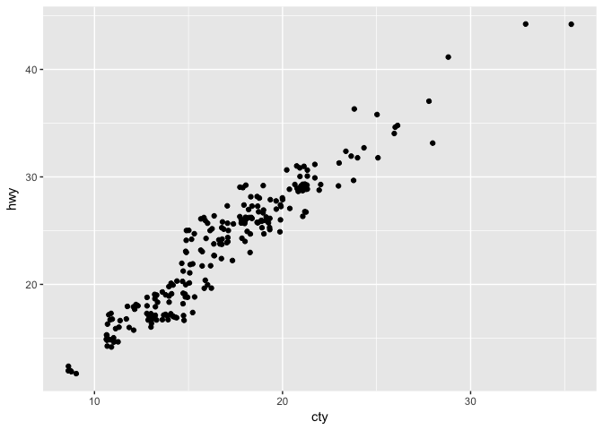<!-- -->

# 2) 
What parameters to geom_jitter() control the amount of jittering?

```r
?geom_jitter 
ggplot(data = mpg, mapping = aes(x = cty, y = hwy)) + 
  geom_point()
```

<!-- -->

```r
ggplot(data = mpg, mapping = aes(x = cty, y = hwy)) + 
  geom_point(position = "jitter")
```

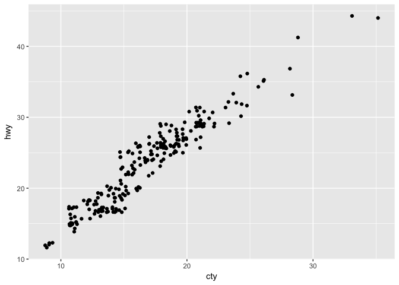<!-- -->

```r
ggplot(data = mpg, mapping = aes(x = cty, y = hwy)) + 
  geom_jitter(width = 10, height = 10)
```

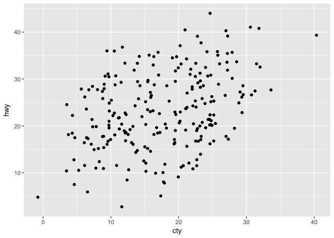<!-- -->

```r
ggplot(data = mpg, mapping = aes(x = cty, y = hwy)) + 
  geom_jitter(width = 10, height = 1)
```

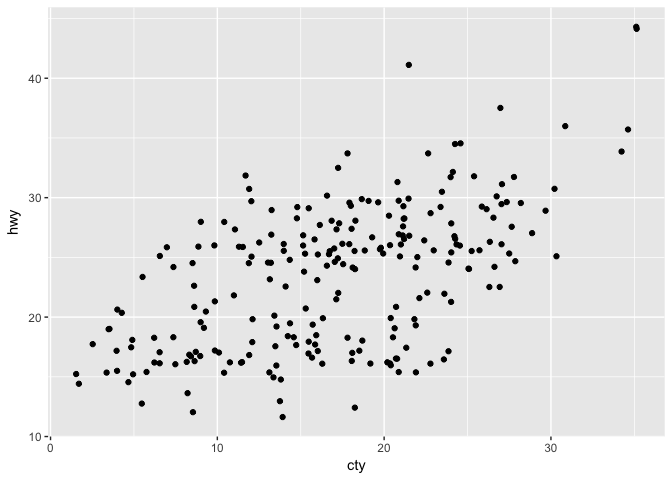<!-- -->

```r
ggplot(data = mpg, mapping = aes(x = cty, y = hwy)) + 
  geom_jitter(width = 1, height = 1) 
```

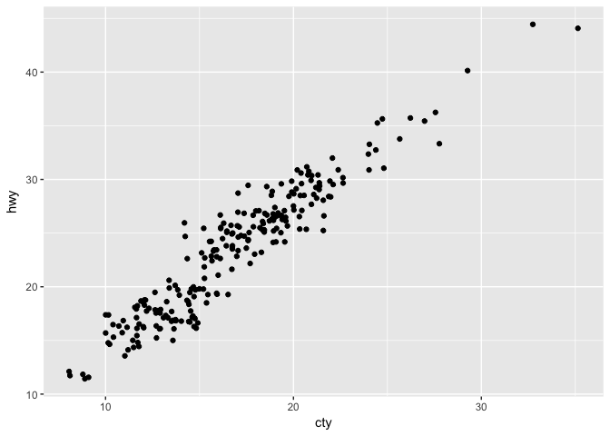<!-- -->

# 3) 
Compare and contrast geom_jitter() with geom_count() 

```r
ggplot(data = mpg, mapping = aes(x = cty, y = hwy)) + 
  geom_jitter()
```

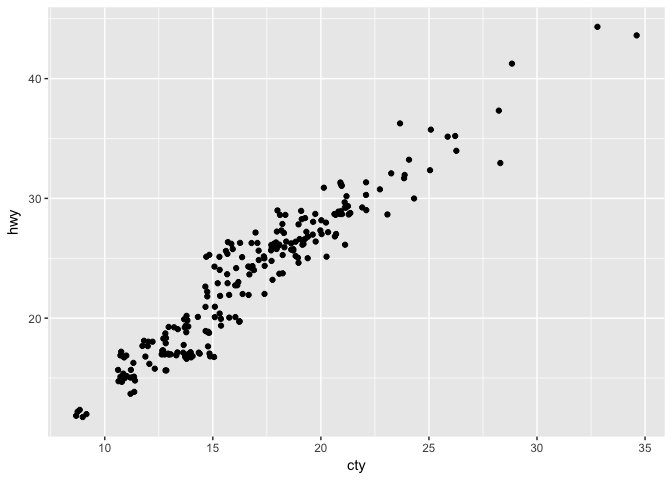<!-- -->

```r
ggplot(data = mpg, mapping = aes(x = cty, y = hwy)) + 
  geom_count()
```

<!-- -->

```r
ggplot(data = mpg, mapping = aes(x = cty, y = hwy)) + 
  geom_count() + 
  geom_jitter()
```

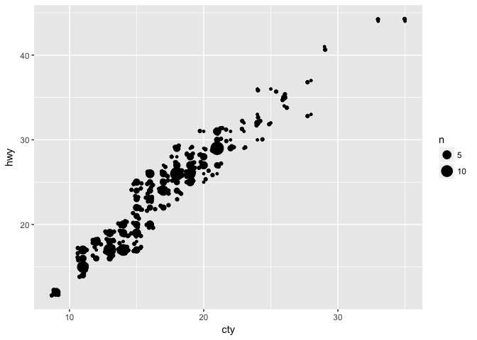<!-- -->

```r
?geom_count # counts the number of observations at each location, then maps the count to point area. 
```

# 4) 
What’s the default position adjustment for geom_boxplot()? Create a visualisation of the mpg dataset that demonstrates it. 

```r
?geom_boxplot # identity OR dodge OR fill OR jitter OR stack

ggplot(data = mpg, mapping = aes(x = drv, y = hwy, color = class)) + 
  geom_boxplot() 
```

<!-- -->

```r
ggplot(data = mpg, mapping = aes(x = drv, y = hwy, color = class)) + 
  geom_boxplot(position = "dodge") 
```

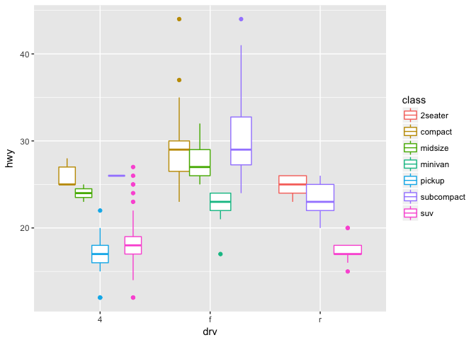<!-- -->

```r
ggplot(data = mpg, mapping = aes(x = drv, y = hwy, color = class)) + 
  geom_boxplot(position = "identity") 
```

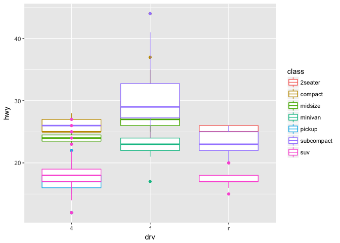<!-- -->

```r
ggplot(data = mpg, mapping = aes(x = drv, y = hwy, color = class)) + 
  geom_boxplot(position = "fill") 
```

```
## Warning: Stacking not well defined when not anchored on the axis
```

```
## Warning: Removed 11 rows containing missing values (position_stack).
```

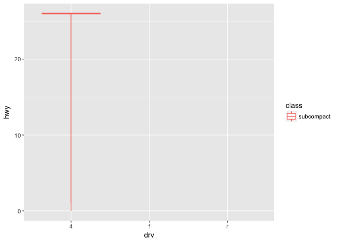<!-- -->

```r
ggplot(data = mpg, mapping = aes(x = drv, y = hwy, color = class)) + 
  geom_boxplot(position = "jitter") 
```

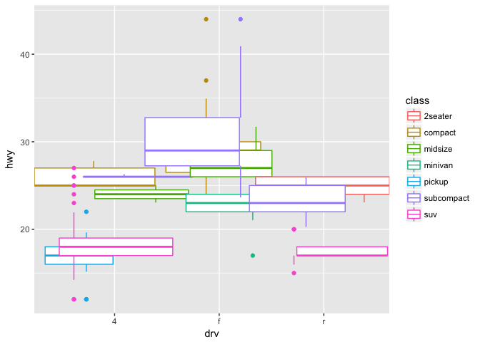<!-- -->

```r
ggplot(data = mpg, mapping = aes(x = drv, y = hwy, color = class)) + 
  geom_boxplot(position = "stack") 
```

```
## Warning: Stacking not well defined when not anchored on the axis

## Warning: Removed 11 rows containing missing values (position_stack).
```

<!-- -->
 
## 3.9.1 Exercises
# 1) 
Turn a stacked bar chart into a pie chart using coord_polar().

```r
p <- ggplot(data = diamonds) + 
  geom_bar(mapping = aes(x = cut, y = ..prop.., fill = color)) 
p + coord_polar()
```

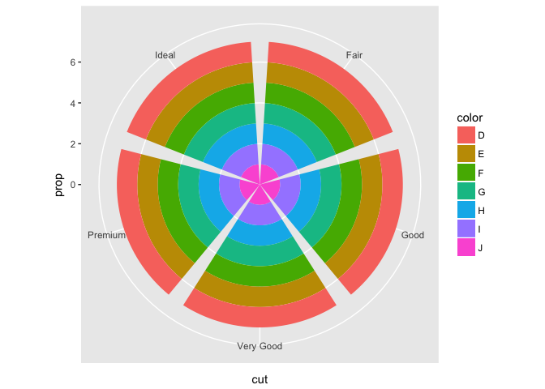<!-- -->

# 2) 
What does labs() do? Read the documentation.

```r
?labs # modify axis, legend and plot labels 
```

# 3) 
What’s the difference between coord_quickmap() and coord_map()

```r
# install.packages("mapproj")
library("mapproj")
```

```
## Loading required package: maps
```

```
## Warning: package 'maps' was built under R version 3.2.5
```

```r
library("maps")
nz <- map_data("nz")

ggplot(nz, aes(long, lat, group = group)) +
  geom_polygon(fill = "white", colour = "black")
```

<!-- -->

```r
ggplot(nz, aes(long, lat, group = group)) +
  geom_polygon(fill = "white", colour = "black") +
  coord_quickmap() 
```

<!-- -->

```r
ggplot(nz, aes(long, lat, group = group)) +
  geom_polygon(fill = "white", colour = "black") +
  coord_map()
```

<!-- -->

```r
?coord_map
?coord_quickmap
```

# 4) 
What does the plot below tell you about the relationship between city and highway mpg? Why is coord_fixed() important? What does geom_abline() do?

```r
ggplot(data = mpg, mapping = aes(x = cty, y = hwy)) +
  geom_point() + 
  geom_abline() +
  coord_fixed()
```

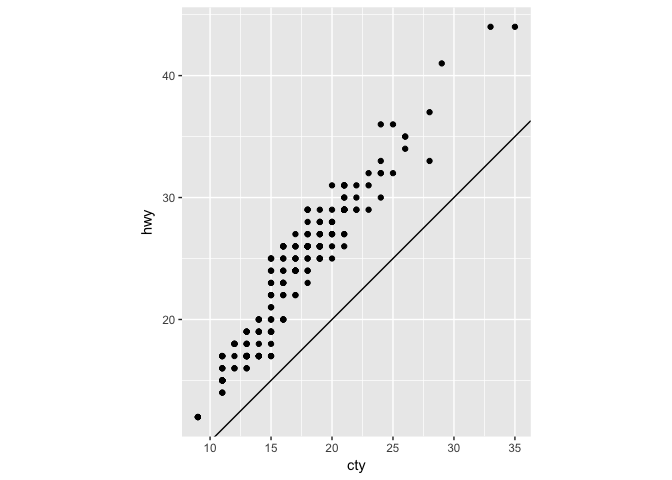<!-- -->

```r
ggplot(data = mpg, mapping = aes(x = cty, y = hwy)) +
  geom_point() + 
  geom_abline() 
```

<!-- -->

```r
ggplot(data = mpg, mapping = aes(x = cty, y = hwy)) +
  geom_point() 
```

<!-- -->

```r
# almost linear relationship. 
?geom_abline
?coord_fixed 
```


