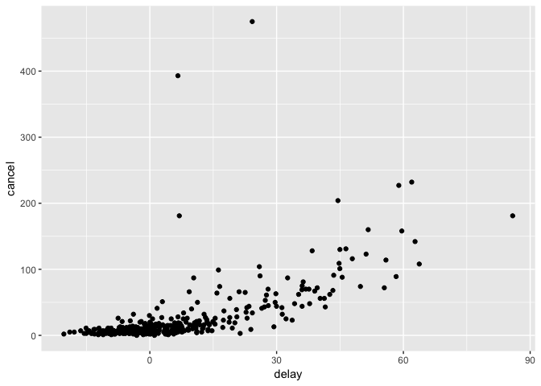

# Assignment_05_17_2017
Ruijuan Li  
5/17/2017  


```r
library(nycflights13)
```

```
## Warning: package 'nycflights13' was built under R version 3.2.5
```

```r
library(tidyverse)
```

```
## Warning: package 'tidyverse' was built under R version 3.2.5
```

```
## Loading tidyverse: ggplot2
## Loading tidyverse: tibble
## Loading tidyverse: tidyr
## Loading tidyverse: readr
## Loading tidyverse: purrr
## Loading tidyverse: dplyr
```

```
## Warning: package 'ggplot2' was built under R version 3.2.5
```

```
## Warning: package 'tibble' was built under R version 3.2.5
```

```
## Warning: package 'tidyr' was built under R version 3.2.5
```

```
## Warning: package 'readr' was built under R version 3.2.5
```

```
## Warning: package 'purrr' was built under R version 3.2.5
```

```
## Warning: package 'dplyr' was built under R version 3.2.5
```

```
## Conflicts with tidy packages ----------------------------------------------
```

```
## filter(): dplyr, stats
## lag():    dplyr, stats
```

```r
# summarise() group_by() 
```

## 5.6.7 Exercises

# 1) Brainstorm at least 5 different ways to assess the typical delay characteristics of a group of flights. Consider the following scenarios:

A flight is 15 minutes early 50% of the time, and 15 minutes late 50% of the time.

```r
flights %>%
  group_by(flight) %>%
  summarize(early_15_min = sum(arr_delay == -15, na.rm = TRUE) / n(),
            late_15_min = sum(arr_delay == 15, na.rm = TRUE) / n()) %>%
  filter(early_15_min == 0.5,
         late_15_min == 0.5)
```

```
## # A tibble: 0 × 3
## # ... with 3 variables: flight <int>, early_15_min <dbl>,
## #   late_15_min <dbl>
```

A flight is always 10 minutes late.

```r
group_by(flights, flight) %>% 
  filter(arr_delay == 10) %>%
  select(flight) 
```

```
## Source: local data frame [3,373 x 1]
## Groups: flight [1,475]
## 
##    flight
##     <int>
## 1    4599
## 2     850
## 3      59
## 4     219
## 5     675
## 6     120
## 7     743
## 8    4135
## 9    1053
## 10   3985
## # ... with 3,363 more rows
```

A flight is 30 minutes early 50% of the time, and 30 minutes late 50% of the time.

```r
flights %>%
  group_by(flight) %>%
  summarize(early_15_min = sum(arr_delay == -30, na.rm = TRUE) / n(),
            late_15_min = sum(arr_delay == 30, na.rm = TRUE) / n()) %>%
  filter(early_15_min == 0.5,
         late_15_min == 0.5)
```

```
## # A tibble: 0 × 3
## # ... with 3 variables: flight <int>, early_15_min <dbl>,
## #   late_15_min <dbl>
```

99% of the time a flight is on time. 1% of the time it’s 2 hours late.

```r
flights %>%
  group_by(flight) %>%
  summarize(early_15_min = sum(arr_delay == 0, na.rm = TRUE) / n(),
            late_15_min = sum(arr_delay >= 120, na.rm = TRUE) / n()) %>%
  filter(early_15_min == 0.99,
         late_15_min == 0.01)
```

```
## # A tibble: 0 × 3
## # ... with 3 variables: flight <int>, early_15_min <dbl>,
## #   late_15_min <dbl>
```

Which is more important: arrival delay or departure delay?

```r
# don't understand the question 
```

# 2) Come up with another approach that will give you the same output as not_cancelled %>% count(dest) and not_cancelled %>% count(tailnum, wt = distance) (without using count()).

```r
not_cancelled <- flights %>% 
  filter(!is.na(dep_delay), !is.na(arr_delay))

not_cancelled %>% 
  count(dest)
```

```
## # A tibble: 104 × 2
##     dest     n
##    <chr> <int>
## 1    ABQ   254
## 2    ACK   264
## 3    ALB   418
## 4    ANC     8
## 5    ATL 16837
## 6    AUS  2411
## 7    AVL   261
## 8    BDL   412
## 9    BGR   358
## 10   BHM   269
## # ... with 94 more rows
```

```r
group_by(not_cancelled, dest) %>% 
  summarise(n())
```

```
## # A tibble: 104 × 2
##     dest `n()`
##    <chr> <int>
## 1    ABQ   254
## 2    ACK   264
## 3    ALB   418
## 4    ANC     8
## 5    ATL 16837
## 6    AUS  2411
## 7    AVL   261
## 8    BDL   412
## 9    BGR   358
## 10   BHM   269
## # ... with 94 more rows
```

```r
not_cancelled %>%
  count(tailnum, wt = distance)
```

```
## # A tibble: 4,037 × 2
##    tailnum      n
##      <chr>  <dbl>
## 1   D942DN   3418
## 2   N0EGMQ 239143
## 3   N10156 109664
## 4   N102UW  25722
## 5   N103US  24619
## 6   N104UW  24616
## 7   N10575 139903
## 8   N105UW  23618
## 9   N107US  21677
## 10  N108UW  32070
## # ... with 4,027 more rows
```

```r
group_by(not_cancelled, tailnum) %>%
  summarise(sum(distance)) 
```

```
## # A tibble: 4,037 × 2
##    tailnum `sum(distance)`
##      <chr>           <dbl>
## 1   D942DN            3418
## 2   N0EGMQ          239143
## 3   N10156          109664
## 4   N102UW           25722
## 5   N103US           24619
## 6   N104UW           24616
## 7   N10575          139903
## 8   N105UW           23618
## 9   N107US           21677
## 10  N108UW           32070
## # ... with 4,027 more rows
```

# 3) Our definition of cancelled flights (is.na(dep_delay) | is.na(arr_delay) ) is slightly suboptimal. Why? Which is the most important column?

```r
colnames(flights) 
```

```
##  [1] "year"           "month"          "day"            "dep_time"      
##  [5] "sched_dep_time" "dep_delay"      "arr_time"       "sched_arr_time"
##  [9] "arr_delay"      "carrier"        "flight"         "tailnum"       
## [13] "origin"         "dest"           "air_time"       "distance"      
## [17] "hour"           "minute"         "time_hour"
```

```r
summary(flights)
```

```
##       year          month             day           dep_time   
##  Min.   :2013   Min.   : 1.000   Min.   : 1.00   Min.   :   1  
##  1st Qu.:2013   1st Qu.: 4.000   1st Qu.: 8.00   1st Qu.: 907  
##  Median :2013   Median : 7.000   Median :16.00   Median :1401  
##  Mean   :2013   Mean   : 6.549   Mean   :15.71   Mean   :1349  
##  3rd Qu.:2013   3rd Qu.:10.000   3rd Qu.:23.00   3rd Qu.:1744  
##  Max.   :2013   Max.   :12.000   Max.   :31.00   Max.   :2400  
##                                                  NA's   :8255  
##  sched_dep_time   dep_delay          arr_time    sched_arr_time
##  Min.   : 106   Min.   : -43.00   Min.   :   1   Min.   :   1  
##  1st Qu.: 906   1st Qu.:  -5.00   1st Qu.:1104   1st Qu.:1124  
##  Median :1359   Median :  -2.00   Median :1535   Median :1556  
##  Mean   :1344   Mean   :  12.64   Mean   :1502   Mean   :1536  
##  3rd Qu.:1729   3rd Qu.:  11.00   3rd Qu.:1940   3rd Qu.:1945  
##  Max.   :2359   Max.   :1301.00   Max.   :2400   Max.   :2359  
##                 NA's   :8255      NA's   :8713                 
##    arr_delay          carrier              flight       tailnum         
##  Min.   : -86.000   Length:336776      Min.   :   1   Length:336776     
##  1st Qu.: -17.000   Class :character   1st Qu.: 553   Class :character  
##  Median :  -5.000   Mode  :character   Median :1496   Mode  :character  
##  Mean   :   6.895                      Mean   :1972                     
##  3rd Qu.:  14.000                      3rd Qu.:3465                     
##  Max.   :1272.000                      Max.   :8500                     
##  NA's   :9430                                                           
##     origin              dest              air_time        distance   
##  Length:336776      Length:336776      Min.   : 20.0   Min.   :  17  
##  Class :character   Class :character   1st Qu.: 82.0   1st Qu.: 502  
##  Mode  :character   Mode  :character   Median :129.0   Median : 872  
##                                        Mean   :150.7   Mean   :1040  
##                                        3rd Qu.:192.0   3rd Qu.:1389  
##                                        Max.   :695.0   Max.   :4983  
##                                        NA's   :9430                  
##       hour           minute        time_hour                  
##  Min.   : 1.00   Min.   : 0.00   Min.   :2013-01-01 05:00:00  
##  1st Qu.: 9.00   1st Qu.: 8.00   1st Qu.:2013-04-04 13:00:00  
##  Median :13.00   Median :29.00   Median :2013-07-03 10:00:00  
##  Mean   :13.18   Mean   :26.23   Mean   :2013-07-03 05:02:36  
##  3rd Qu.:17.00   3rd Qu.:44.00   3rd Qu.:2013-10-01 07:00:00  
##  Max.   :23.00   Max.   :59.00   Max.   :2013-12-31 23:00:00  
## 
```

# 4) Look at the number of cancelled flights per day. Is there a pattern? Is the proportion of cancelled flights related to the average delay?

```r
tmp <- group_by(flights, year, month, day) %>% 
  summarise(cancel = sum(is.na(dep_delay) | is.na(arr_delay)),
            delay = mean(arr_delay, na.rm=T)) 

cor.test(tmp$cancel, tmp$delay) # positively correlated
```

```
## 
## 	Pearson's product-moment correlation
## 
## data:  tmp$cancel and tmp$delay
## t = 15.742, df = 363, p-value < 2.2e-16
## alternative hypothesis: true correlation is not equal to 0
## 95 percent confidence interval:
##  0.5716923 0.6942221
## sample estimates:
##      cor 
## 0.636963
```

```r
plot(tmp$cancel, tmp$delay)
```

<!-- -->

# 5) Which carrier has the worst delays? Challenge: can you disentangle the effects of bad airports vs. bad carriers? Why/why not? (Hint: think about flights %>% group_by(carrier, dest) %>% summarise(n()))

```r
flights %>% 
  group_by(carrier, dest) %>%
  summarise(n(), 
            delay = mean(arr_delay, na.rm=T)) %>% 
  arrange(desc(delay)) 
```

```
## Source: local data frame [314 x 4]
## Groups: carrier [16]
## 
##    carrier  dest `n()`     delay
##      <chr> <chr> <int>     <dbl>
## 1       UA   STL     2 110.00000
## 2       OO   ORD     1 107.00000
## 3       OO   DTW     2  68.50000
## 4       UA   RDU     1  56.00000
## 5       EV   CAE   113  42.80583
## 6       EV   TYS   323  41.15016
## 7       EV   PBI     6  40.66667
## 8       EV   TUL   315  33.65986
## 9       EV   OKC   346  30.61905
## 10      UA   JAC    23  29.89474
## # ... with 304 more rows
```

```r
# when don't consider dest 
flights %>% 
  group_by(carrier) %>%
  summarise(n(), 
            delay = mean(arr_delay, na.rm=T)) %>% 
  arrange(desc(delay)) 
```

```
## # A tibble: 16 × 3
##    carrier `n()`      delay
##      <chr> <int>      <dbl>
## 1       F9   685 21.9207048
## 2       FL  3260 20.1159055
## 3       EV 54173 15.7964311
## 4       YV   601 15.5569853
## 5       OO    32 11.9310345
## 6       MQ 26397 10.7747334
## 7       WN 12275  9.6491199
## 8       B6 54635  9.4579733
## 9       9E 18460  7.3796692
## 10      UA 58665  3.5580111
## 11      US 20536  2.1295951
## 12      VX  5162  1.7644644
## 13      DL 48110  1.6443409
## 14      AA 32729  0.3642909
## 15      HA   342 -6.9152047
## 16      AS   714 -9.9308886
```

```r
# F9 has the worst delay  
```

# 6) What does the sort argument to count() do. When might you use it?

```r
?count
```

```
## Help on topic 'count' was found in the following packages:
## 
##   Package               Library
##   plyr                  /Library/Frameworks/R.framework/Versions/3.2/Resources/library
##   dplyr                 /Library/Frameworks/R.framework/Versions/3.2/Resources/library
## 
## 
## Using the first match ...
```

```r
# copied from somewhere: The sort argument to count() sorts by descending order of n. This is useful because often the most common group is the most important. 
```

## 5.7.1 Exercises

# 1) Refer back to the lists of useful mutate and filtering functions. Describe how each operation changes when you combine it with grouping.

```r
# mutate & filtering will work within each group. 
```

# 2) Which plane (tailnum) has the worst on-time record?

```r
flights %>% 
  group_by(tailnum) %>% 
  summarise(delay = mean(arr_delay)) %>%
  arrange(desc(delay)) 
```

```
## # A tibble: 4,044 × 2
##    tailnum    delay
##      <chr>    <dbl>
## 1   N844MH 320.0000
## 2   N911DA 294.0000
## 3   N922EV 276.0000
## 4   N587NW 264.0000
## 5   N851NW 219.0000
## 6   N928DN 201.0000
## 7   N7715E 188.0000
## 8   N654UA 185.0000
## 9   N665MQ 174.6667
## 10  N427SW 157.0000
## # ... with 4,034 more rows
```

# 3) What time of day should you fly if you want to avoid delays as much as possible?

```r
flights %>% 
  group_by(year, month, day, time_hour) %>% 
  summarise(delay = mean(arr_delay)) %>% 
  arrange(delay) 
```

```
## Source: local data frame [6,936 x 5]
## Groups: year, month, day [365]
## 
##     year month   day           time_hour     delay
##    <int> <int> <int>              <dttm>     <dbl>
## 1   2013     9    24 2013-09-24 23:00:00 -32.00000
## 2   2013     3    15 2013-03-15 05:00:00 -30.20000
## 3   2013     9    15 2013-09-15 05:00:00 -29.00000
## 4   2013     4     8 2013-04-08 23:00:00 -28.33333
## 5   2013     5    14 2013-05-14 23:00:00 -28.00000
## 6   2013     9    28 2013-09-28 19:00:00 -27.80000
## 7   2013     5    14 2013-05-14 05:00:00 -26.80000
## 8   2013     9     7 2013-09-07 21:00:00 -26.60000
## 9   2013     8    28 2013-08-28 05:00:00 -26.20000
## 10  2013     9     7 2013-09-07 17:00:00 -26.04348
## # ... with 6,926 more rows
```

# 4) For each destination, compute the total minutes of delay. For each, flight, compute the proportion of the total delay for its destination.

```r
flights %>% 
  group_by(dest) %>%
  summarise(sum(arr_delay, na.rm=T))
```

```
## # A tibble: 105 × 2
##     dest `sum(arr_delay, na.rm = T)`
##    <chr>                       <dbl>
## 1    ABQ                        1113
## 2    ACK                        1281
## 3    ALB                        6018
## 4    ANC                         -20
## 5    ATL                      190260
## 6    AUS                       14514
## 7    AVL                        2089
## 8    BDL                        2904
## 9    BGR                        2874
## 10   BHM                        4540
## # ... with 95 more rows
```

```r
flights %>% 
  group_by(flight) %>% 
  summarise(prop_delay = sum(arr_delay >= 0, na.rm = TRUE) / n()) 
```

```
## # A tibble: 3,844 × 2
##    flight prop_delay
##     <int>      <dbl>
## 1       1  0.3880171
## 2       2  0.2745098
## 3       3  0.3597464
## 4       4  0.3740458
## 5       5  0.2839506
## 6       6  0.2619048
## 7       7  0.3966245
## 8       8  0.3050847
## 9       9  0.5228758
## 10     10  0.4262295
## # ... with 3,834 more rows
```

# 5) Delays are typically temporally correlated: even once the problem that caused the initial delay has been resolved, later flights are delayed to allow earlier flights to leave. Using lag() explore how the delay of a flight is related to the delay of the immediately preceding flight.

```r
# ah, this is more complicated... 
```

# 6) Look at each destination. Can you find flights that are suspiciously fast? (i.e. flights that represent a potential data entry error). Compute the air time a flight relative to the shortest flight to that destination. Which flights were most delayed in the air?

```r
flights %>% 
  group_by(dest) %>% 
  summarise(air_time_ratio = (mean(air_time, na.rm=T)/min(air_time, na.rm=T))) 
```

```
## # A tibble: 105 × 2
##     dest air_time_ratio
##    <chr>          <dbl>
## 1    ABQ       1.175327
## 2    ACK       1.201948
## 3    ALB       1.324462
## 4    ANC       1.064755
## 5    ATL       1.737392
## 6    AUS       1.222574
## 7    AVL       1.182749
## 8    BDL       1.273301
## 9    BGR       1.176463
## 10   BHM       1.169304
## # ... with 95 more rows
```

# 7) Find all destinations that are flown by at least two carriers. Use that information to rank the carriers.

```r
flights %>% 
  group_by(dest) %>% 
  summarise(unique_carrier = length(unique(carrier))) %>% 
            filter(unique_carrier >= 2)  
```

```
## # A tibble: 76 × 2
##     dest unique_carrier
##    <chr>          <int>
## 1    ATL              7
## 2    AUS              6
## 3    AVL              2
## 4    BDL              2
## 5    BGR              2
## 6    BNA              5
## 7    BOS              7
## 8    BQN              2
## 9    BTV              3
## 10   BUF              4
## # ... with 66 more rows
```

# 8) For each plane, count the number of flights before the first delay of greater than 1 hour.


