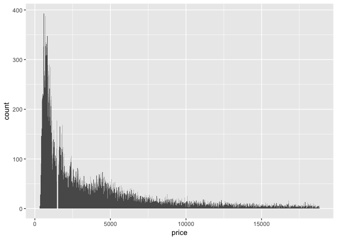
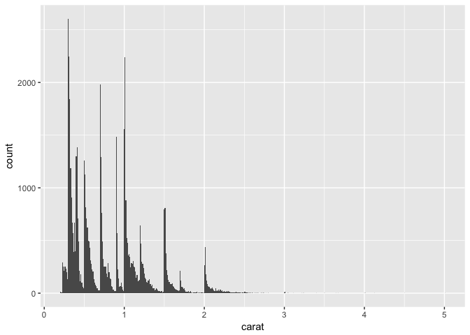

# Assignment_05_23_2017
Ruijuan Li  
5/23/2017  

7.3.4 Exercises

Explore the distribution of each of the x, y, and z variables in diamonds. What do you learn? Think about a diamond and how you might decide which dimension is the length, width, and depth.

```r
library(tidyverse)
```

```
## Warning: package 'tidyverse' was built under R version 3.2.5
```

```
## Loading tidyverse: ggplot2
## Loading tidyverse: tibble
## Loading tidyverse: tidyr
## Loading tidyverse: readr
## Loading tidyverse: purrr
## Loading tidyverse: dplyr
```

```
## Warning: package 'ggplot2' was built under R version 3.2.5
```

```
## Warning: package 'tibble' was built under R version 3.2.5
```

```
## Warning: package 'tidyr' was built under R version 3.2.5
```

```
## Warning: package 'readr' was built under R version 3.2.5
```

```
## Warning: package 'purrr' was built under R version 3.2.5
```

```
## Warning: package 'dplyr' was built under R version 3.2.5
```

```
## Conflicts with tidy packages ----------------------------------------------
```

```
## filter(): dplyr, stats
## lag():    dplyr, stats
```

```r
summary(diamonds)
```

```
##      carat               cut        color        clarity     
##  Min.   :0.2000   Fair     : 1610   D: 6775   SI1    :13065  
##  1st Qu.:0.4000   Good     : 4906   E: 9797   VS2    :12258  
##  Median :0.7000   Very Good:12082   F: 9542   SI2    : 9194  
##  Mean   :0.7979   Premium  :13791   G:11292   VS1    : 8171  
##  3rd Qu.:1.0400   Ideal    :21551   H: 8304   VVS2   : 5066  
##  Max.   :5.0100                     I: 5422   VVS1   : 3655  
##                                     J: 2808   (Other): 2531  
##      depth           table           price             x         
##  Min.   :43.00   Min.   :43.00   Min.   :  326   Min.   : 0.000  
##  1st Qu.:61.00   1st Qu.:56.00   1st Qu.:  950   1st Qu.: 4.710  
##  Median :61.80   Median :57.00   Median : 2401   Median : 5.700  
##  Mean   :61.75   Mean   :57.46   Mean   : 3933   Mean   : 5.731  
##  3rd Qu.:62.50   3rd Qu.:59.00   3rd Qu.: 5324   3rd Qu.: 6.540  
##  Max.   :79.00   Max.   :95.00   Max.   :18823   Max.   :10.740  
##                                                                  
##        y                z         
##  Min.   : 0.000   Min.   : 0.000  
##  1st Qu.: 4.720   1st Qu.: 2.910  
##  Median : 5.710   Median : 3.530  
##  Mean   : 5.735   Mean   : 3.539  
##  3rd Qu.: 6.540   3rd Qu.: 4.040  
##  Max.   :58.900   Max.   :31.800  
## 
```

```r
ggplot(diamonds) + geom_histogram(mapping = aes(x=x), binwidth = 0.5)
```

<!-- -->

```r
ggplot(diamonds) + geom_histogram(mapping = aes(x=y), binwidth = 0.5)
```

<!-- -->

```r
ggplot(diamonds) + geom_histogram(mapping = aes(x=y), binwidth = 0.5) +  coord_cartesian(ylim = c(0, 50))
```

<!-- -->

```r
ggplot(diamonds) + geom_histogram(mapping = aes(x=z), binwidth = 0.5) + coord_cartesian(ylim = c(0, 2500))
```

<!-- -->

```r
ggplot(diamonds) + geom_histogram(mapping = aes(x=z)) + coord_cartesian(ylim = c(0, 2500))
```

```
## `stat_bin()` using `bins = 30`. Pick better value with `binwidth`.
```

<!-- -->

```r
# not very familiar with diamond... 
```

Explore the distribution of price. Do you discover anything unusual or surprising? (Hint: Carefully think about the binwidth and make sure you try a wide range of values.)

```r
ggplot(diamonds) + geom_histogram(aes(x=price), binwidth = 1000)
```

<!-- -->

```r
diamonds %>% 
  count(cut_width(price, 1000)) 
```

```
## # A tibble: 20 × 2
##    `cut_width(price, 1000)`     n
##                      <fctr> <int>
## 1                [-500,500]  1749
## 2             (500,1.5e+03] 18261
## 3         (1.5e+03,2.5e+03]  7532
## 4         (2.5e+03,3.5e+03]  4958
## 5         (3.5e+03,4.5e+03]  4535
## 6         (4.5e+03,5.5e+03]  3950
## 7         (5.5e+03,6.5e+03]  2627
## 8         (6.5e+03,7.5e+03]  1946
## 9         (7.5e+03,8.5e+03]  1395
## 10        (8.5e+03,9.5e+03]  1253
## 11       (9.5e+03,1.05e+04]  1000
## 12      (1.05e+04,1.15e+04]   899
## 13      (1.15e+04,1.25e+04]   721
## 14      (1.25e+04,1.35e+04]   655
## 15      (1.35e+04,1.45e+04]   576
## 16      (1.45e+04,1.55e+04]   482
## 17      (1.55e+04,1.65e+04]   471
## 18      (1.65e+04,1.75e+04]   437
## 19      (1.75e+04,1.85e+04]   391
## 20      (1.85e+04,1.95e+04]   102
```

```r
?cut_width 

# most of the diamond's price fall between 500 to 1.5e+03
ggplot(diamonds) + geom_histogram(aes(x=price), binwidth = 100)
```

<!-- -->

```r
diamond_price_bin_100 <- diamonds %>% 
  count(cut_width(price, 100)) 

head(diamond_price_bin_100, 20)
```

```
## # A tibble: 20 × 2
##    `cut_width(price, 100)`     n
##                     <fctr> <int>
## 1                [250,350]    17
## 2                (350,450]   876
## 3                (450,550]  1930
## 4                (550,650]  2717
## 5                (650,750]  2888
## 6                (750,850]  2696
## 7                (850,950]  2366
## 8               (950,1050]  2000
## 9              (1050,1150]  1510
## 10             (1150,1250]  1124
## 11             (1250,1350]   882
## 12             (1350,1450]   988
## 13             (1450,1550]    66
## 14             (1550,1650]   965
## 15             (1650,1750]  1005
## 16             (1750,1850]  1050
## 17             (1850,1950]   772
## 18             (1950,2050]   671
## 19             (2050,2150]   662
## 20             (2150,2250]   597
```

```r
# when have smaller bin, price ranged from 1450 to 1550 have suprisingly samll number of diamond 

ggplot(diamonds) + geom_histogram(aes(x=price), binwidth = 10)
```

<!-- -->

```r
# for a specific range, there is no diamond in that price range 
# zoom in 
ggplot(diamonds) + geom_histogram(aes(x=price), binwidth = 10) +  coord_cartesian(xlim = c(0, 2000))
```

<!-- -->

```r
ggplot(diamonds) + geom_histogram(aes(x=price)) +  coord_cartesian(xlim = c(0, 2000))
```

```
## `stat_bin()` using `bins = 30`. Pick better value with `binwidth`.
```

<!-- -->

```r
# no diamond is the price range around 1500, why? 
```

How many diamonds are 0.99 carat? How many are 1 carat? What do you think is the cause of the difference?

```r
ggplot(diamonds) + geom_histogram(mapping = aes(x=carat), binwidth = 0.01)
```

<!-- -->

```r
diamonds %>% 
  filter(carat == 0.99) %>%
    count()
```

```
## # A tibble: 1 × 1
##       n
##   <int>
## 1    23
```

```r
diamonds %>% 
  filter(carat == 1) %>%
    count()
```

```
## # A tibble: 1 × 1
##       n
##   <int>
## 1  1558
```

```r
# people like 1 carate diamond 
```

Compare and contrast coord_cartesian() vs xlim() or ylim() when zooming in on a histogram. What happens if you leave binwidth unset? What happens if you try and zoom so only half a bar shows?

```r
# see above, when you don't set binwidth, the default is bins = 30 
```

7.4.1 Exercises

What happens to missing values in a histogram? What happens to missing values in a bar chart? Why is there a difference?

```r
diamonds2 <- diamonds %>% 
  mutate(y = ifelse(y < 3 | y > 20, NA, y))

summary(diamonds2)
```

```
##      carat               cut        color        clarity     
##  Min.   :0.2000   Fair     : 1610   D: 6775   SI1    :13065  
##  1st Qu.:0.4000   Good     : 4906   E: 9797   VS2    :12258  
##  Median :0.7000   Very Good:12082   F: 9542   SI2    : 9194  
##  Mean   :0.7979   Premium  :13791   G:11292   VS1    : 8171  
##  3rd Qu.:1.0400   Ideal    :21551   H: 8304   VVS2   : 5066  
##  Max.   :5.0100                     I: 5422   VVS1   : 3655  
##                                     J: 2808   (Other): 2531  
##      depth           table           price             x         
##  Min.   :43.00   Min.   :43.00   Min.   :  326   Min.   : 0.000  
##  1st Qu.:61.00   1st Qu.:56.00   1st Qu.:  950   1st Qu.: 4.710  
##  Median :61.80   Median :57.00   Median : 2401   Median : 5.700  
##  Mean   :61.75   Mean   :57.46   Mean   : 3933   Mean   : 5.731  
##  3rd Qu.:62.50   3rd Qu.:59.00   3rd Qu.: 5324   3rd Qu.: 6.540  
##  Max.   :79.00   Max.   :95.00   Max.   :18823   Max.   :10.740  
##                                                                  
##        y                z         
##  Min.   : 3.680   Min.   : 0.000  
##  1st Qu.: 4.720   1st Qu.: 2.910  
##  Median : 5.710   Median : 3.530  
##  Mean   : 5.734   Mean   : 3.539  
##  3rd Qu.: 6.540   3rd Qu.: 4.040  
##  Max.   :10.540   Max.   :31.800  
##  NA's   :9
```

```r
ggplot(data = diamonds2, mapping = aes(x = y)) + 
  geom_histogram(binwidth = 0.01)
```

```
## Warning: Removed 9 rows containing non-finite values (stat_bin).
```

<!-- -->

```r
ggplot(data = diamonds2, mapping = aes(x = carat, y = y)) + 
  geom_col()
```

```
## Warning: Removed 9 rows containing missing values (position_stack).
```

<!-- -->

```r
# geom_col remove them bc they are missing, geom_histogram remove them because they are not finite values 
```

What does na.rm = TRUE do in mean() and sum()?

```r
numbers <- seq(1:100)
numbers
```

```
##   [1]   1   2   3   4   5   6   7   8   9  10  11  12  13  14  15  16  17
##  [18]  18  19  20  21  22  23  24  25  26  27  28  29  30  31  32  33  34
##  [35]  35  36  37  38  39  40  41  42  43  44  45  46  47  48  49  50  51
##  [52]  52  53  54  55  56  57  58  59  60  61  62  63  64  65  66  67  68
##  [69]  69  70  71  72  73  74  75  76  77  78  79  80  81  82  83  84  85
##  [86]  86  87  88  89  90  91  92  93  94  95  96  97  98  99 100
```

```r
missing_data <- rep(NA, 10)
all <- c(numbers, missing_data)
all
```

```
##   [1]   1   2   3   4   5   6   7   8   9  10  11  12  13  14  15  16  17
##  [18]  18  19  20  21  22  23  24  25  26  27  28  29  30  31  32  33  34
##  [35]  35  36  37  38  39  40  41  42  43  44  45  46  47  48  49  50  51
##  [52]  52  53  54  55  56  57  58  59  60  61  62  63  64  65  66  67  68
##  [69]  69  70  71  72  73  74  75  76  77  78  79  80  81  82  83  84  85
##  [86]  86  87  88  89  90  91  92  93  94  95  96  97  98  99 100  NA  NA
## [103]  NA  NA  NA  NA  NA  NA  NA  NA
```

```r
mean(all)
```

```
## [1] NA
```

```r
mean(all, na.rm = T)
```

```
## [1] 50.5
```

```r
sum(all)
```

```
## [1] NA
```

```r
sum(all, na.rm = T)
```

```
## [1] 5050
```

```r
# na.rm remove the missing value & their position in the data. so mean is only the mean of non-missing data devided by the number of non-missing data. 
```

7.5.1.1 Exercises

Use what you’ve learned to improve the visualisation of the departure times of cancelled vs. non-cancelled flights.

```r
# data
new <- 
  nycflights13::flights %>% 
  mutate(
    cancelled = is.na(dep_time),
    sched_hour = sched_dep_time %/% 100,
    sched_min = sched_dep_time %% 100,
    sched_dep_time = sched_hour + sched_min / 60
  ) 

# the original 
ggplot(new, mapping = aes(sched_dep_time)) + 
    geom_freqpoly(mapping = aes(colour = cancelled), binwidth = 1/4)
```

<!-- -->

```r
# improved 
ggplot(new, mapping = aes(sched_dep_time, y = ..density..)) + 
    geom_freqpoly(mapping = aes(colour = cancelled), binwidth = 1/4)
```

<!-- -->

What variable in the diamonds dataset is most important for predicting the price of a diamond? How is that variable correlated with cut? Why does the combination of those two relationships lead to lower quality diamonds being more expensive?

```r
library(reshape2)
```

```
## Warning: package 'reshape2' was built under R version 3.2.5
```

```
## 
## Attaching package: 'reshape2'
```

```
## The following object is masked from 'package:tidyr':
## 
##     smiths
```

```r
summary(diamonds) 
```

```
##      carat               cut        color        clarity     
##  Min.   :0.2000   Fair     : 1610   D: 6775   SI1    :13065  
##  1st Qu.:0.4000   Good     : 4906   E: 9797   VS2    :12258  
##  Median :0.7000   Very Good:12082   F: 9542   SI2    : 9194  
##  Mean   :0.7979   Premium  :13791   G:11292   VS1    : 8171  
##  3rd Qu.:1.0400   Ideal    :21551   H: 8304   VVS2   : 5066  
##  Max.   :5.0100                     I: 5422   VVS1   : 3655  
##                                     J: 2808   (Other): 2531  
##      depth           table           price             x         
##  Min.   :43.00   Min.   :43.00   Min.   :  326   Min.   : 0.000  
##  1st Qu.:61.00   1st Qu.:56.00   1st Qu.:  950   1st Qu.: 4.710  
##  Median :61.80   Median :57.00   Median : 2401   Median : 5.700  
##  Mean   :61.75   Mean   :57.46   Mean   : 3933   Mean   : 5.731  
##  3rd Qu.:62.50   3rd Qu.:59.00   3rd Qu.: 5324   3rd Qu.: 6.540  
##  Max.   :79.00   Max.   :95.00   Max.   :18823   Max.   :10.740  
##                                                                  
##        y                z         
##  Min.   : 0.000   Min.   : 0.000  
##  1st Qu.: 4.720   1st Qu.: 2.910  
##  Median : 5.710   Median : 3.530  
##  Mean   : 5.735   Mean   : 3.539  
##  3rd Qu.: 6.540   3rd Qu.: 4.040  
##  Max.   :58.900   Max.   :31.800  
## 
```

```r
diamonds.melt <- melt(diamonds, id.vars = "price")
```

```
## Warning: attributes are not identical across measure variables; they will
## be dropped
```

```r
head(diamonds.melt)
```

```
##   price variable value
## 1   326    carat  0.23
## 2   326    carat  0.21
## 3   327    carat  0.23
## 4   334    carat  0.29
## 5   335    carat  0.31
## 6   336    carat  0.24
```

```r
dim(diamonds.melt)
```

```
## [1] 485460      3
```

```r
# ggplot(diamonds.melt, mapping = aes(price, y = value)) + 
#    geom_point() + facet_wrap(~variable)

# not a good way 
cor(diamonds$price, diamonds$carat)
```

```
## [1] 0.9215913
```

```r
cor(diamonds$price, diamonds$depth)
```

```
## [1] -0.0106474
```

```r
cor(diamonds$price, diamonds$table)
```

```
## [1] 0.1271339
```

```r
cor(diamonds$price, diamonds$x)
```

```
## [1] 0.8844352
```

```r
cor(diamonds$price, diamonds$y)
```

```
## [1] 0.8654209
```

```r
cor(diamonds$price, diamonds$z)
```

```
## [1] 0.8612494
```

```r
# carat has the highest correlation with price 
ggplot(data = diamonds, mapping = aes(x = cut, y = carat)) +
  geom_boxplot()
```

<!-- -->

```r
# the good diamond don't have high carat, higher carate diamond sells expensive 
```

Install the ggstance package, and create a horizontal boxplot. How does this compare to using coord_flip()?

```r
# install.packages("ggstance")
library(ggstance)
```

```
## Warning: package 'ggstance' was built under R version 3.2.5
```

```
## 
## Attaching package: 'ggstance'
```

```
## The following objects are masked from 'package:ggplot2':
## 
##     geom_errorbarh, GeomErrorbarh
```

```r
# with coord_flip
ggplot(data = mpg) +
  geom_boxplot(mapping = aes(x = reorder(class, hwy, FUN = median), y = hwy)) +
  coord_flip()
```

<!-- -->

```r
# with ggstance
ggplot(data = mpg) +
  geom_boxploth(mapping = aes(x = reorder(class, hwy, FUN = median), y = hwy))
```

```
## Warning: position_dodgev requires non-overlapping y intervals
```

<!-- -->

```r
ggplot(data = mpg) +
  geom_boxploth(mapping = aes(y = reorder(class, hwy, FUN = median), x = hwy))
```

<!-- -->

```r
# just need to flip the x & y coordinate 
```

One problem with boxplots is that they were developed in an era of much smaller datasets and tend to display a prohibitively large number of “outlying values”. One approach to remedy this problem is the letter value plot. Install the lvplot package, and try using geom_lv() to display the distribution of price vs cut. What do you learn? How do you interpret the plots?

```r
#install.packages("lvplot")

# library("lvplot")
# ggplot(diamonds, aes(x = cut, y = price)) +
#   geom_lv()
# package incompatibility, will fix later... 
```

Compare and contrast geom_violin() with a facetted geom_histogram(), or a coloured geom_freqpoly(). What are the pros and cons of each method?

```r
# discuss in class 
```

If you have a small dataset, it’s sometimes useful to use geom_jitter() to see the relationship between a continuous and categorical variable. The ggbeeswarm package provides a number of methods similar to geom_jitter(). List them and briefly describe what each one does.

```r
# install.packages("ggbeeswarm")
library(ggbeeswarm)
```

```
## Warning: package 'ggbeeswarm' was built under R version 3.2.5
```

[see the examples] (https://jrnold.github.io/e4qf/exploratory-data-analysis.html#a-categorical-and-continuous-variable)

7.5.2.1 Exercises

How could you rescale the count dataset above to more clearly show the distribution of cut within colour, or colour within cut?


Use geom_tile() together with dplyr to explore how average flight delays vary by destination and month of year. What makes the plot difficult to read? How could you improve it?


Why is it slightly better to use aes(x = color, y = cut) rather than aes(x = cut, y = color) in the example above?


7.5.3.1 Exercises

Instead of summarising the conditional distribution with a boxplot, you could use a frequency polygon. What do you need to consider when using cut_width() vs cut_number()? How does that impact a visualisation of the 2d distribution of carat and price?


Visualise the distribution of carat, partitioned by price.


How does the price distribution of very large diamonds compare to small diamonds. Is it as you expect, or does it surprise you?


Combine two of the techniques you’ve learned to visualise the combined distribution of cut, carat, and price.


Two dimensional plots reveal outliers that are not visible in one dimensional plots. For example, some points in the plot below have an unusual combination of x and y values, which makes the points outliers even though their x and y values appear normal when examined separately.

Why is a scatterplot a better display than a binned plot for this case?


