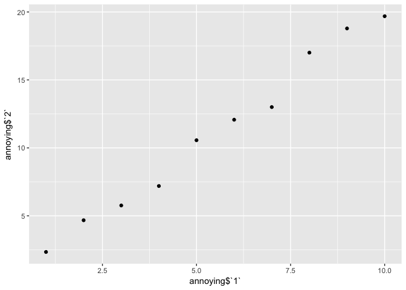

# Assignment_05_31_2017
Ruijuan Li  
5/28/2017  

10.5 Exercises

1. How can you tell if an object is a tibble? (Hint: try printing mtcars, which is a regular data frame).

```r
library(ggplot2)
```

```
## Warning: package 'ggplot2' was built under R version 3.2.5
```

```r
library(tidyverse)
```

```
## Warning: package 'tidyverse' was built under R version 3.2.5
```

```
## Loading tidyverse: tibble
## Loading tidyverse: tidyr
## Loading tidyverse: readr
## Loading tidyverse: purrr
## Loading tidyverse: dplyr
```

```
## Warning: package 'tibble' was built under R version 3.2.5
```

```
## Warning: package 'tidyr' was built under R version 3.2.5
```

```
## Warning: package 'readr' was built under R version 3.2.5
```

```
## Warning: package 'purrr' was built under R version 3.2.5
```

```
## Warning: package 'dplyr' was built under R version 3.2.5
```

```
## Conflicts with tidy packages ----------------------------------------------
```

```
## filter(): dplyr, stats
## lag():    dplyr, stats
```

```r
class(mtcars)
```

```
## [1] "data.frame"
```

2. Compare and contrast the following operations on a data.frame and equivalent tibble. What is different? Why might the default data frame behaviours cause you frustration?

      df <- data.frame(abc = 1, xyz = "a")
      df$x
      df[, "xyz"] 
      df[, c("abc", "xyz")] 


```r
df <- data.frame(abc = 1, xyz = "a")
df$x # I even don't know this before! 
```

```
## [1] a
## Levels: a
```

```r
class(df[, "xyz"]) 
```

```
## [1] "factor"
```

```r
df[, c("abc", "xyz")] 
```

```
##   abc xyz
## 1   1   a
```

```r
test <- tibble(abc = 1, xyz = "a")
test[["xyz"]] 
```

```
## [1] "a"
```

```r
# compared to data.frame, tibble, cannot do subsetting using [], it returns another tibble, and tibble doens't do partial matching.  
```

3. If you have the name of a variable stored in an object, e.g. var <- "mpg", how can you extract the reference variable from a tibble?

```r
# tibble[["mpg"]]
```

4. Practice referring to non-syntactic names in the following data frame by:

      1. Extracting the variable called 1.

      2. Plotting a scatterplot of 1 vs 2.

      3. Creating a new column called 3 which is 2 divided by 1.

      4. Renaming the columns to one, two and three.


```r
annoying <- tibble(
  `1` = 1:10,
  `2` = `1` * 2 + rnorm(length(`1`))
)
```


```r
# 1) 
annoying[["2"]]
```

```
##  [1]  2.342724  4.676571  5.764106  7.194370 10.562349 12.070684 13.002044
##  [8] 17.008089 18.788531 19.688685
```

```r
# 2) 
ggplot(annoying) + geom_point(aes(annoying$`1`, annoying$`2`))
```

<!-- -->

```r
# 3) 
annoying2 <- mutate(annoying, `3` = `2`/`1`)
# 4) 
colnames(annoying2) <- c("one", "two", "three")
View(annoying2)
```

5. What does tibble::enframe() do? When might you use it?

```r
?enframe # enframe() converts named atomic vectors or lists to two-column data frames. For unnamed vectors, the natural sequence is used as name column. 
enframe(1:3)
```

```
## # A tibble: 3 × 2
##    name value
##   <int> <int>
## 1     1     1
## 2     2     2
## 3     3     3
```

```r
enframe(c(a = 5, b = 7))
```

```
## # A tibble: 2 × 2
##    name value
##   <chr> <dbl>
## 1     a     5
## 2     b     7
```

6. What option controls how many additional column names are printed at the footer of a tibble?

```r
nycflights13::flights %>% 
  print(n = 3, width = Inf) # n for rows, width = Inf print all columns  
```

```
## # A tibble: 336,776 × 19
##    year month   day dep_time sched_dep_time dep_delay arr_time
##   <int> <int> <int>    <int>          <int>     <dbl>    <int>
## 1  2013     1     1      517            515         2      830
## 2  2013     1     1      533            529         4      850
## 3  2013     1     1      542            540         2      923
##   sched_arr_time arr_delay carrier flight tailnum origin  dest air_time
##            <int>     <dbl>   <chr>  <int>   <chr>  <chr> <chr>    <dbl>
## 1            819        11      UA   1545  N14228    EWR   IAH      227
## 2            830        20      UA   1714  N24211    LGA   IAH      227
## 3            850        33      AA   1141  N619AA    JFK   MIA      160
##   distance  hour minute           time_hour
##      <dbl> <dbl>  <dbl>              <dttm>
## 1     1400     5     15 2013-01-01 05:00:00
## 2     1416     5     29 2013-01-01 05:00:00
## 3     1089     5     40 2013-01-01 05:00:00
## # ... with 3.368e+05 more rows
```

```r
nycflights13::flights %>% 
  print(n = 3, width = NULL, n_extra = 2)  
```

```
## # A tibble: 336,776 × 19
##    year month   day dep_time sched_dep_time dep_delay arr_time
##   <int> <int> <int>    <int>          <int>     <dbl>    <int>
## 1  2013     1     1      517            515         2      830
## 2  2013     1     1      533            529         4      850
## 3  2013     1     1      542            540         2      923
## # ... with 3.368e+05 more rows, and 12 more variables:
## #   sched_arr_time <int>, arr_delay <dbl>, ...
```

```r
nycflights13::flights %>% 
  print(n = 3, width = NULL, n_extra = 7)  
```

```
## # A tibble: 336,776 × 19
##    year month   day dep_time sched_dep_time dep_delay arr_time
##   <int> <int> <int>    <int>          <int>     <dbl>    <int>
## 1  2013     1     1      517            515         2      830
## 2  2013     1     1      533            529         4      850
## 3  2013     1     1      542            540         2      923
## # ... with 3.368e+05 more rows, and 12 more variables:
## #   sched_arr_time <int>, arr_delay <dbl>, carrier <chr>, flight <int>,
## #   tailnum <chr>, origin <chr>, dest <chr>, ...
```

```r
# n_extra 
```


