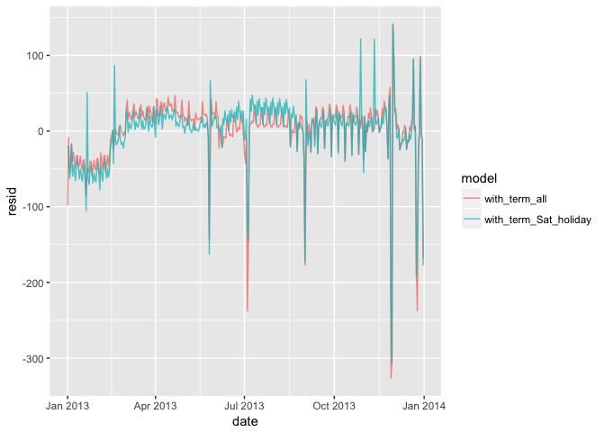

# model_building
Ruijuan Li  
10/27/2017  

### 24.2.3 Exercises

1. In the plot of lcarat vs. lprice, there are some bright vertical strips. What do they represent?

```r
library(tidyverse)
```

```
## Warning: package 'tidyverse' was built under R version 3.2.5
```

```
## Loading tidyverse: ggplot2
## Loading tidyverse: tibble
## Loading tidyverse: tidyr
## Loading tidyverse: readr
## Loading tidyverse: purrr
## Loading tidyverse: dplyr
```

```
## Warning: package 'ggplot2' was built under R version 3.2.5
```

```
## Warning: package 'tibble' was built under R version 3.2.5
```

```
## Warning: package 'tidyr' was built under R version 3.2.5
```

```
## Warning: package 'readr' was built under R version 3.2.5
```

```
## Warning: package 'purrr' was built under R version 3.2.5
```

```
## Warning: package 'dplyr' was built under R version 3.2.5
```

```
## Conflicts with tidy packages ----------------------------------------------
```

```
## filter(): dplyr, stats
## lag():    dplyr, stats
```

```r
library(modelr)
```

```
## Warning: package 'modelr' was built under R version 3.2.5
```

```r
options(na.action=na.warn)

library(nycflights13)
```

```
## Warning: package 'nycflights13' was built under R version 3.2.5
```

```r
library(lubridate)
```

```
## Warning: package 'lubridate' was built under R version 3.2.5
```

```
## 
## Attaching package: 'lubridate'
```

```
## The following object is masked from 'package:base':
## 
##     date
```

```r
library("broom") 
```

```
## Warning: package 'broom' was built under R version 3.2.5
```

```
## 
## Attaching package: 'broom'
```

```
## The following object is masked from 'package:modelr':
## 
##     bootstrap
```

```r
diamonds2 <- diamonds %>% 
  filter(carat <= 2.5) %>% 
  mutate(lprice = log2(price), lcarat = log2(carat))
```

```
## Warning: package 'bindrcpp' was built under R version 3.2.5
```

```r
ggplot(diamonds2, aes(lcarat, lprice)) + 
  geom_hex(bins = 50)
```

<!-- -->

it means just few diamond fall into those ranges 

2. If log(price) = a_0 + a_1 * log(carat), what does that say about the relationship between price and carat?

it says the log of price and log of carat has a linear relationship with a_o as the intercept and a_1 as the slope. 

3. Extract the diamonds that have very high and very low residuals. Is there anything unusual about these diamonds? Are the particularly bad or good, or do you think these are pricing errors?

```r
# high residual 
mod_diamond <- lm(lprice ~ lcarat, data = diamonds2)

diamonds2 <- diamonds2 %>% 
  add_residuals(mod_diamond, "lresid")

diamonds2 %>% 
  filter(abs(lresid) > 1) %>% 
  add_predictions(mod_diamond) %>% 
  mutate(pred = round(2 ^ pred)) %>% 
  select(price, pred, carat:table, x:z) %>% 
  #colnames()
  arrange(price)
```

```
## # A tibble: 743 x 11
##    price  pred carat       cut color clarity depth table     x     y     z
##    <int> <dbl> <dbl>     <ord> <ord>   <ord> <dbl> <dbl> <dbl> <dbl> <dbl>
##  1   410   841  0.36   Premium     J     SI1  61.6  60.0  4.54  4.58  2.81
##  2   451   962  0.39     Ideal     J     SI2  62.6  54.0  4.64  4.69  2.92
##  3   452  1134  0.43   Premium     H      I1  62.0  59.0  4.78  4.83  2.98
##  4   467  1046  0.41      Good     G      I1  63.8  56.0  4.70  4.74  3.01
##  5   468   962  0.39   Premium     H     SI2  61.2  58.0  4.51  6.02  4.44
##  6   484  1004  0.40     Ideal     I     SI2  61.0  58.0  4.74  4.77  2.90
##  7   490  1134  0.43      Good     J     SI2  63.7  57.0  4.76  4.79  3.04
##  8   491  1004  0.40      Good     F      I1  63.3  60.4  4.64  4.68  2.95
##  9   503  1046  0.41      Good     F      I1  63.8  57.0  4.69  4.72  3.00
## 10   555  1134  0.43 Very Good     E      I1  58.4  62.0  4.94  5.00  2.90
## # ... with 733 more rows
```

nothing wrong really, as stated in the text. 

4. Does the final model, mod_diamonds2, do a good job of predicting diamond prices? Would you trust it to tell you how much to spend if you were buying a diamond?

```r
mod_diamond2 <- lm(lprice ~ lcarat + color + cut + clarity, data = diamonds2)

diamonds2 %>% 
  add_predictions(mod_diamond2) %>%
  add_residuals(mod_diamond2) %>%
  summarise(sq_err = sqrt(mean(resid^2)),
            abs_err = mean(abs(resid)),
            p975_err = quantile(resid, 0.975),
            p025_err = quantile(resid, 0.025))
```

```
## # A tibble: 1 x 4
##     sq_err   abs_err  p975_err   p025_err
##      <dbl>     <dbl>     <dbl>      <dbl>
## 1 0.191524 0.1491158 0.3844299 -0.3692446
```

To answer this quesiton, need to check residual. 

### 24.3.5 Exercises

1. Use your Google sleuthing skills to brainstorm why there were fewer than expected flights on Jan 20, May 26, and Sep 1. (Hint: they all have the same explanation.) How would these days generalise to another year?

those are federal holidays. 

2. What do the three days with high positive residuals represent? How would these days generalise to another year?


```r
# daily %>% 
#   top_n(3, resid)
#> # A tibble: 3 × 5
#>         date     n  wday resid   term
#>       <date> <int> <ord> <dbl> <fctr>
#> 1 2013-11-30   857   Sat 112.4   fall
#> 2 2013-12-01   987   Sun  95.5   fall
#> 3 2013-12-28   814   Sat  69.4   fall
```

They are the days after thanksgiving and Christmas. 

3. Create a new variable that splits the wday variable into terms, but only for Saturdays, i.e. it should have Thurs, Fri, but Sat-summer, Sat-spring, Sat-fall. How does this model compare with the model with every combination of wday and term?


```r
daily <- flights %>% 
  mutate(date = make_date(year, month, day)) %>% # way of making date column 
  group_by(date) %>% 
  summarise(n = n())

daily <- daily %>% 
  mutate(wday = wday(date, label = TRUE)) 

term <- function(date) {
  cut(date, 
    breaks = ymd(20130101, 20130605, 20130825, 20140101),
    labels = c("spring", "summer", "fall") 
  )
}

daily <- daily %>% 
  mutate(term = term(date)) 

daily$term_2 <- ifelse(daily$wday=="Sat", paste(daily$wday, daily$term, sep = "-"), daily$wday)

mod2 <- lm(n ~ wday * term, data = daily)
mod4 <- lm(n ~ term_2, data = daily)

daily %>% 
  gather_residuals(with_term_Sat = mod4, with_term_all = mod2) %>% 
  ggplot(aes(date, resid, colour = model)) +
    geom_line(alpha = 0.75)
```

<!-- -->

```r
glance(mod4) %>% select(r.squared, sigma, AIC, df)
```

```
##   r.squared    sigma      AIC df
## 1 0.7356615 47.35969 3862.885  9
```

```r
glance(mod2) %>% select(r.squared, sigma, AIC, df)
```

```
##   r.squared    sigma     AIC df
## 1  0.757289 46.16568 3855.73 21
```

The model with terms x Saturday has higher residuals in the fall, and lower residuals in the spring than the model with all interactions.

Using overall model comparison terms, mod4 has a lower  R2R2  and regression standard error,  σ̂ σ^ , despite using fewer variables. More importantly for prediction purposes, it has a higher AIC - which is an estimate of the out of sample error.

4. Create a new wday variable that combines the day of week, term (for Saturdays), and public holidays. What do the residuals of that model look like?


```r
holidays = lubridate::ymd(c(20130101, # new years
             20130121, # mlk
             20130218, # presidents
             20130527, # memorial
             20130704, # independence
             20130902, # labor
             20131028, # columbus
             20131111, # veterans
             20131128, # thanksgiving
             20131225))

daily$term_3 <- ifelse(daily$date %in% holidays, "holiday", daily$term_2) 
mod5 <- lm(n ~ term_3, data = daily)

daily %>% 
  gather_residuals(with_term_Sat_holiday = mod5, with_term_all = mod2) %>% 
  ggplot(aes(date, resid, colour = model)) +
    geom_line(alpha = 0.75)
```

<!-- -->

```r
glance(mod5) %>% select(r.squared, sigma, AIC, df)
```

```
##   r.squared   sigma     AIC df
## 1 0.7736044 43.8908 3808.33 10
```

```r
glance(mod2) %>% select(r.squared, sigma, AIC, df) 
```

```
##   r.squared    sigma     AIC df
## 1  0.757289 46.16568 3855.73 21
```

5. What happens if you fit a day of week effect that varies by month (i.e. n ~ wday * month)? Why is this not very helpful?

```r
daily$month <- month(as.POSIXlt(daily$date, format="%d-%m-%Y"))
mod6 <- lm(n ~ wday * month, data = daily)

daily %>% 
  gather_residuals(wday_month = mod6, with_term_all = mod2) %>% 
  ggplot(aes(date, resid, colour = model)) +
    geom_line(alpha = 0.75)
```

<!-- -->

```r
glance(mod6) %>% select(r.squared, sigma, AIC, df)
```

```
##   r.squared    sigma      AIC df
## 1 0.7256428 48.59127 3886.464 14
```

```r
glance(mod2) %>% select(r.squared, sigma, AIC, df) 
```

```
##   r.squared    sigma     AIC df
## 1  0.757289 46.16568 3855.73 21
```

6. What would you expect the model n ~ wday + ns(date, 5) to look like? Knowing what you know about the data, why would you expect it to be not particularly effective?


7. We hypothesised that people leaving on Sundays are more likely to be business travellers who need to be somewhere on Monday. Explore that hypothesis by seeing how it breaks down based on distance and time: if it’s true, you’d expect to see more Sunday evening flights to places that are far away. 


8. It’s a little frustrating that Sunday and Saturday are on separate ends of the plot. Write a small function to set the levels of the factor so that the week starts on Monday. 
