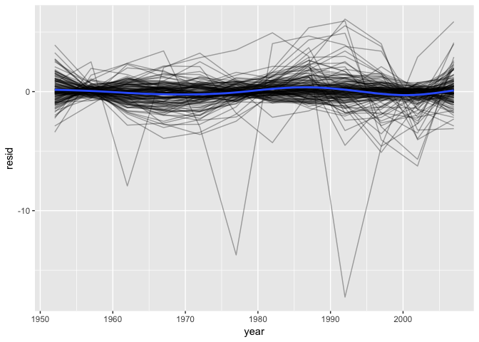
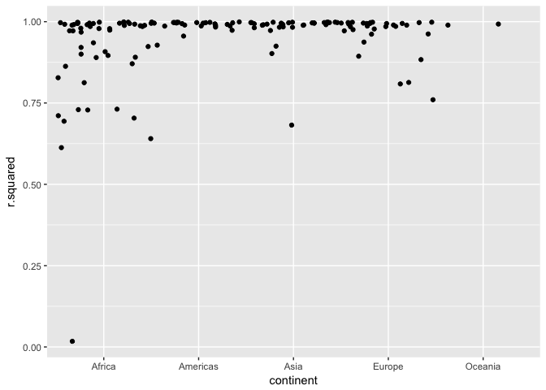
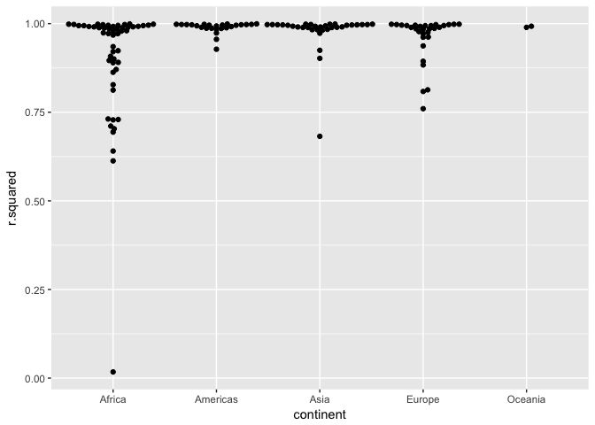
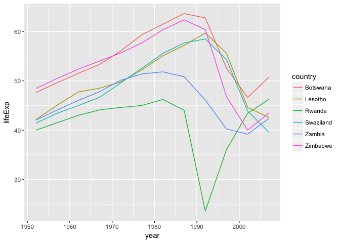

# many_models_list_columns
Ruijuan Li  
10/31/2017  

refer to https://jrnold.github.io/e4qf/many-models.html 
### 25.2.5 Exercises

1. A linear trend seems to be slightly too simple for the overall trend. Can you do better with a quadratic polynomial? How can you interpret the coefficients of the quadratic? (Hint you might want to transform year so that it has mean zero.)


```r
library(modelr)
```

```
## Warning: package 'modelr' was built under R version 3.2.5
```

```r
library(tidyverse)
```

```
## Warning: package 'tidyverse' was built under R version 3.2.5
```

```
## Loading tidyverse: ggplot2
## Loading tidyverse: tibble
## Loading tidyverse: tidyr
## Loading tidyverse: readr
## Loading tidyverse: purrr
## Loading tidyverse: dplyr
```

```
## Warning: package 'ggplot2' was built under R version 3.2.5
```

```
## Warning: package 'tibble' was built under R version 3.2.5
```

```
## Warning: package 'tidyr' was built under R version 3.2.5
```

```
## Warning: package 'readr' was built under R version 3.2.5
```

```
## Warning: package 'purrr' was built under R version 3.2.5
```

```
## Warning: package 'dplyr' was built under R version 3.2.5
```

```
## Conflicts with tidy packages ----------------------------------------------
```

```
## filter(): dplyr, stats
## lag():    dplyr, stats
```

```r
library("gapminder") 

country_model <- function(df) {
  lm(lifeExp ~ poly(year - median(year), 2), data = df)
}

by_country <- gapminder %>% 
  group_by(country, continent) %>% 
  nest()

by_country <- by_country %>%
  mutate(model = map(data, country_model))
```

```
## Warning: package 'bindrcpp' was built under R version 3.2.5
```

```r
by_country <- by_country %>% 
  mutate(
    resids = map2(data, model, add_residuals)
  )
by_country
```

```
## # A tibble: 142 x 5
##        country continent              data    model            resids
##         <fctr>    <fctr>            <list>   <list>            <list>
##  1 Afghanistan      Asia <tibble [12 x 4]> <S3: lm> <tibble [12 x 5]>
##  2     Albania    Europe <tibble [12 x 4]> <S3: lm> <tibble [12 x 5]>
##  3     Algeria    Africa <tibble [12 x 4]> <S3: lm> <tibble [12 x 5]>
##  4      Angola    Africa <tibble [12 x 4]> <S3: lm> <tibble [12 x 5]>
##  5   Argentina  Americas <tibble [12 x 4]> <S3: lm> <tibble [12 x 5]>
##  6   Australia   Oceania <tibble [12 x 4]> <S3: lm> <tibble [12 x 5]>
##  7     Austria    Europe <tibble [12 x 4]> <S3: lm> <tibble [12 x 5]>
##  8     Bahrain      Asia <tibble [12 x 4]> <S3: lm> <tibble [12 x 5]>
##  9  Bangladesh      Asia <tibble [12 x 4]> <S3: lm> <tibble [12 x 5]>
## 10     Belgium    Europe <tibble [12 x 4]> <S3: lm> <tibble [12 x 5]>
## # ... with 132 more rows
```

```r
unnest(by_country, resids) %>%
ggplot(aes(year, resid)) +
  geom_line(aes(group = country), alpha = 1 / 3) + 
  geom_smooth(se = FALSE)
```

```
## `geom_smooth()` using method = 'gam'
```

<!-- -->

```r
by_country %>% 
  mutate(glance = map(model, broom::glance)) %>%
  unnest(glance, .drop = TRUE) %>%
  ggplot(aes(continent, r.squared)) +
  geom_jitter(width = 0.5) 
```

<!-- -->

2. Explore other methods for visualising the distribution of R square per continent. You might want to try the ggbeeswarm package, which provides similar methods for avoiding overlaps as jitter, but uses deterministic methods.

```r
library("ggbeeswarm")
```

```
## Warning: package 'ggbeeswarm' was built under R version 3.2.5
```

```r
by_country %>% 
  mutate(glance = map(model, broom::glance)) %>%
  unnest(glance, .drop = TRUE) %>%
  ggplot(aes(continent, r.squared)) +
  geom_beeswarm()
```

<!-- -->

3. To create the last plot (showing the data for the countries with the worst model fits), we needed two steps: we created a data frame with one row per country and then semi-joined it to the original dataset. It’s possible avoid this join if we use unnest() instead of unnest(.drop = TRUE). How? 

```r
by_country <- gapminder %>% 
  group_by(country, continent) %>% 
  nest() 

country_model <- function(df) {
  lm(lifeExp ~ year, data = df)
}

models <- map(by_country$data, country_model)

by_country <- by_country %>% 
  mutate(model = map(data, country_model))

by_country <- by_country %>% 
  mutate(
    resids = map2(data, model, add_residuals)
  )

glance <- by_country %>% 
  mutate(glance = map(model, broom::glance)) %>% 
  unnest(glance) # drop unrelated columns 

bad_fit <- filter(glance, r.squared < 0.25)

gapminder %>% 
  semi_join(bad_fit, by = "country") %>% 
  ggplot(aes(year, lifeExp, colour = country)) +
    geom_line()
```

<!-- -->

```r
bad_fit %>% 
  unnest(data) %>%
  ggplot(aes(year, lifeExp, colour = country)) +
    geom_line() 
```

<!-- -->

### 25.4.5 Exercises

1. List all the functions that you can think of that take a atomic vector and return a list.
skip

2. Brainstorm useful summary functions that, like quantile(), return multiple values.
skip

3. What’s missing in the following data frame? How does quantile() return that missing piece? Why isn’t that helpful here?


```r
mtcars %>% 
  group_by(cyl) %>% 
  summarise(q = list(quantile(mpg))) %>% 
  unnest()
```

```
## # A tibble: 15 x 2
##      cyl     q
##    <dbl> <dbl>
##  1     4 21.40
##  2     4 22.80
##  3     4 26.00
##  4     4 30.40
##  5     4 33.90
##  6     6 17.80
##  7     6 18.65
##  8     6 19.70
##  9     6 21.00
## 10     6 21.40
## 11     8 10.40
## 12     8 14.40
## 13     8 15.20
## 14     8 16.25
## 15     8 19.20
```

```r
#> # A tibble: 15 × 2
#>     cyl     q
#>   <dbl> <dbl>
#> 1     4  21.4
#> 2     4  22.8
#> 3     4  26.0
#> 4     4  30.4
#> 5     4  33.9
#> 6     6  17.8
#> # ... with 9 more rows

# miss which quantile info 
probs <- c(0.01, 0.25, 0.5, 0.75, 0.99)
mtcars %>% 
  group_by(cyl) %>% 
  summarise(p = list(probs), q = list(quantile(mpg, probs))) %>% 
  unnest()  
```

```
## # A tibble: 15 x 3
##      cyl     p      q
##    <dbl> <dbl>  <dbl>
##  1     4  0.01 21.410
##  2     4  0.25 22.800
##  3     4  0.50 26.000
##  4     4  0.75 30.400
##  5     4  0.99 33.750
##  6     6  0.01 17.818
##  7     6  0.25 18.650
##  8     6  0.50 19.700
##  9     6  0.75 21.000
## 10     6  0.99 21.376
## 11     8  0.01 10.400
## 12     8  0.25 14.400
## 13     8  0.50 15.200
## 14     8  0.75 16.250
## 15     8  0.99 19.135
```


4. What does this code do? Why might it be useful?


```r
mtcars %>% 
  group_by(cyl) %>% 
  summarise_each(funs(list)) 
```

```
## `summarise_each()` is deprecated.
## Use `summarise_all()`, `summarise_at()` or `summarise_if()` instead.
## To map `funs` over all variables, use `summarise_all()`
```

```
## # A tibble: 3 x 11
##     cyl        mpg       disp         hp       drat         wt       qsec
##   <dbl>     <list>     <list>     <list>     <list>     <list>     <list>
## 1     4 <dbl [11]> <dbl [11]> <dbl [11]> <dbl [11]> <dbl [11]> <dbl [11]>
## 2     6  <dbl [7]>  <dbl [7]>  <dbl [7]>  <dbl [7]>  <dbl [7]>  <dbl [7]>
## 3     8 <dbl [14]> <dbl [14]> <dbl [14]> <dbl [14]> <dbl [14]> <dbl [14]>
## # ... with 4 more variables: vs <list>, am <list>, gear <list>,
## #   carb <list>
```

create a list of three items for each column corresponding to cyl of 4, 6, and 8. 


