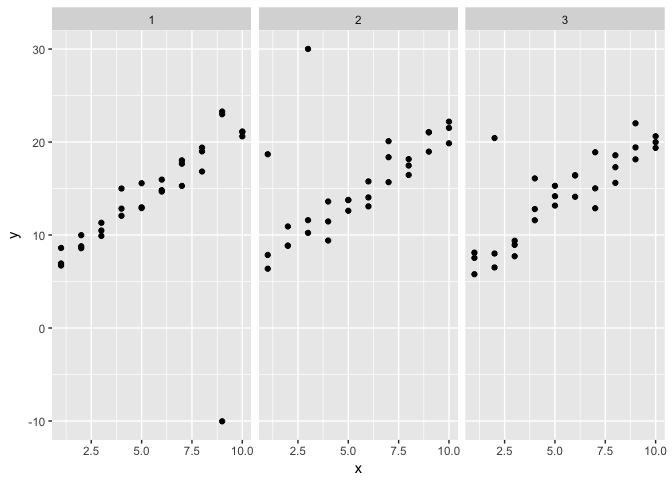

# Assignment_09_20_2017
Ruijuan Li  
9/20/2017  


```r
library(tidyverse)
```

```
## Warning: package 'tidyverse' was built under R version 3.2.5
```

```
## Loading tidyverse: ggplot2
## Loading tidyverse: tibble
## Loading tidyverse: tidyr
## Loading tidyverse: readr
## Loading tidyverse: purrr
## Loading tidyverse: dplyr
```

```
## Warning: package 'ggplot2' was built under R version 3.2.5
```

```
## Warning: package 'tibble' was built under R version 3.2.5
```

```
## Warning: package 'tidyr' was built under R version 3.2.5
```

```
## Warning: package 'readr' was built under R version 3.2.5
```

```
## Warning: package 'purrr' was built under R version 3.2.5
```

```
## Warning: package 'dplyr' was built under R version 3.2.5
```

```
## Conflicts with tidy packages ----------------------------------------------
```

```
## filter(): dplyr, stats
## lag():    dplyr, stats
```

```r
library(modelr)
```

```
## Warning: package 'modelr' was built under R version 3.2.5
```

```r
options(na.action = na.warn)
```

### 23.2.1 Exercises

1. One downside of the linear model is that it is sensitive to unusual values because the distance incorporates a squared term. Fit a linear model to the simulated data below, and visualise the results. Rerun a few times to generate different simulated datasets. What do you notice about the model?


```r
set.seed(1)
sim1a <- tibble(
  x = rep(1:10, each = 3),
  y = x * 1.5 + 6 + rt(length(x), df = 2)
)

set.seed(2)
sim1b <- tibble(
  x = rep(1:10, each = 3),
  y = x * 1.5 + 6 + rt(length(x), df = 2)
)

set.seed(3)
sim1c <- tibble(
  x = rep(1:10, each = 3),
  y = x * 1.5 + 6 + rt(length(x), df = 2)
)
```


```r
mod1 <- lm(y ~ x, data = sim1a)
coef(mod1) 
```

```
## (Intercept)           x 
##    7.313038    1.175975
```

```r
mod2 <- lm(y ~ x, data = sim1b)
coef(mod2) 
```

```
## (Intercept)           x 
##    9.103362    1.143513
```

```r
mod3 <- lm(y ~ x, data = sim1c)
coef(mod3) 
```

```
## (Intercept)           x 
##    6.901589    1.353228
```

```r
sim_all <- rbind(sim1a, sim1b, sim1c) 
sim_all$class <- rep(1:3, each=30)
ggplot(sim_all) + 
  geom_point(aes(x=x, y=y)) + 
  facet_wrap(~class)
```

<!-- -->

2. One way to make linear models more robust is to use a different distance measure. For example, instead of root-mean-squared distance, you could use mean-absolute distance:


```r
model1 <- function(a, data) {
  a[1] + data$x * a[2]
}

measure_distance <- function(mod, data) {
  diff <- data$y - model1(mod, data) # change make_prediction to model1
  mean(abs(diff))
}
```

Use optim() to fit this model to the simulated data above and compare it to the linear model.


```r
sim1_dist <- function(a1, a2) {
  measure_distance(c(a1, a2), sim1)
}

best <- optim(c(0, 0), measure_distance, data = sim1a)
best$par 
```

```
## [1] 5.924879 1.520463
```

```r
coef(mod1) # different, why? 
```

```
## (Intercept)           x 
##    7.313038    1.175975
```

3. One challenge with performing numerical optimisation is that it’s only guaranteed to find one local optima. What’s the problem with optimising a three parameter model like this?


```r
model2 <- function(a, data) {
  a[1] + data$x * a[2] + a[3]
}

# a1 + a3 will be the intercept 
```

