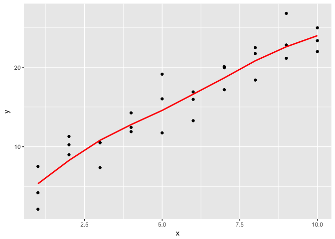

# Assignment_09_27_2017
Ruijuan Li  
9/27/2017  


```r
library(tidyverse)
```

```
## Warning: package 'tidyverse' was built under R version 3.2.5
```

```
## Loading tidyverse: ggplot2
## Loading tidyverse: tibble
## Loading tidyverse: tidyr
## Loading tidyverse: readr
## Loading tidyverse: purrr
## Loading tidyverse: dplyr
```

```
## Warning: package 'ggplot2' was built under R version 3.2.5
```

```
## Warning: package 'tibble' was built under R version 3.2.5
```

```
## Warning: package 'tidyr' was built under R version 3.2.5
```

```
## Warning: package 'readr' was built under R version 3.2.5
```

```
## Warning: package 'purrr' was built under R version 3.2.5
```

```
## Warning: package 'dplyr' was built under R version 3.2.5
```

```
## Conflicts with tidy packages ----------------------------------------------
```

```
## filter(): dplyr, stats
## lag():    dplyr, stats
```

```r
library(modelr)
```

```
## Warning: package 'modelr' was built under R version 3.2.5
```

23.3.3 Exercises

1. Instead of using lm() to fit a straight line, you can use loess() to fit a smooth curve. Repeat the process of model fitting, grid generation, predictions, and visualisation on sim1 using loess() instead of lm(). How does the result compare to geom_smooth()?

```r
sim1_mod <- lm(y ~ x, data = sim1)
sim2_mod <- loess(y ~ x, data = sim1)

grid1 <- sim1 %>% 
  data_grid(x)

grid1 <- grid1 %>% 
  add_predictions(sim1_mod) 

ggplot(sim1, aes(x)) +
  geom_point(aes(y = y)) +
  geom_line(aes(y = pred), data = grid1, colour = "red", size = 1) 
```

<!-- -->

```r
grid2 <- sim1 %>% 
  data_grid(x)

grid2 <- grid1 %>% 
  add_predictions(sim2_mod) 

ggplot(sim1, aes(x)) +
  geom_point(aes(y = y)) +
  geom_line(aes(y = pred), data = grid2, colour = "red", size = 1) 
```

<!-- -->

```r
ggplot(sim1) + 
  geom_point(aes(x = x, y=y)) + 
  geom_smooth(mapping = aes(x = x, y = y))
```

```
## `geom_smooth()` using method = 'loess'
```

<!-- -->

```r
# loess is more similar to geom_smooth 
?loess # Local Polynomial Regression Fitting: Fit a polynomial surface determined by one or more numerical predictors, using local fitting. 
```

2. add_predictions() is paired with gather_predictions() and spread_predictions(). How do these three functions differ?

```r
# Add predictions to a data frame

df <- tibble::data_frame(
  x = sort(runif(100)),
  y = 5 * x + 0.5 * x ^ 2 + 3 + rnorm(length(x))
)
plot(df)
```

<!-- -->

```r
m1 <- lm(y ~ x, data = df)
grid <- data.frame(x = seq(0, 1, length = 10))
grid %>% add_predictions(m1)
```

```
##            x     pred
## 1  0.0000000 2.740053
## 2  0.1111111 3.400191
## 3  0.2222222 4.060329
## 4  0.3333333 4.720467
## 5  0.4444444 5.380606
## 6  0.5555556 6.040744
## 7  0.6666667 6.700882
## 8  0.7777778 7.361020
## 9  0.8888889 8.021159
## 10 1.0000000 8.681297
```

```r
m2 <- lm(y ~ poly(x, 2), data = df)
grid %>% spread_predictions(m1, m2) # add one column for each model
```

```
##            x       m1       m2
## 1  0.0000000 2.740053 2.941461
## 2  0.1111111 3.400191 3.469028
## 3  0.2222222 4.060329 4.029780
## 4  0.3333333 4.720467 4.623717
## 5  0.4444444 5.380606 5.250838
## 6  0.5555556 6.040744 5.911144
## 7  0.6666667 6.700882 6.604635
## 8  0.7777778 7.361020 7.331311
## 9  0.8888889 8.021159 8.091171
## 10 1.0000000 8.681297 8.884216
```

```r
grid %>% gather_predictions(m1, m2) # add prediction but in long format 
```

```
##    model         x     pred
## 1     m1 0.0000000 2.740053
## 2     m1 0.1111111 3.400191
## 3     m1 0.2222222 4.060329
## 4     m1 0.3333333 4.720467
## 5     m1 0.4444444 5.380606
## 6     m1 0.5555556 6.040744
## 7     m1 0.6666667 6.700882
## 8     m1 0.7777778 7.361020
## 9     m1 0.8888889 8.021159
## 10    m1 1.0000000 8.681297
## 11    m2 0.0000000 2.941461
## 12    m2 0.1111111 3.469028
## 13    m2 0.2222222 4.029780
## 14    m2 0.3333333 4.623717
## 15    m2 0.4444444 5.250838
## 16    m2 0.5555556 5.911144
## 17    m2 0.6666667 6.604635
## 18    m2 0.7777778 7.331311
## 19    m2 0.8888889 8.091171
## 20    m2 1.0000000 8.884216
```

3. What does geom_ref_line() do? What package does it come from? Why is displaying a reference line in plots showing residuals useful and important?

```r
?geom_ref_line # add a reference line, came with package modelr. 
# the importance is to see residuals are evenly spread across the reference line. 
```

4. Why might you want to look at a frequency polygon of absolute residuals? What are the pros and cons compared to looking at the raw residuals?

```r
# we are expecting a normal distribution of residual. mostly 0 and less and less when they are deviated from 0. 
```

### 23.4.5 Exercises

1. What happens if you repeat the analysis of sim2 using a model without an intercept. What happens to the model equation? What happens to the predictions?

2. Use model_matrix() to explore the equations generated for the models I fit to sim3 and sim4. Why is * a good shorthand for interaction?

3. Using the basic principles, convert the formulas in the following two models into functions. (Hint: start by converting the categorical variable into 0-1 variables.)


```r
mod1 <- lm(y ~ x1 + x2, data = sim3)
mod2 <- lm(y ~ x1 * x2, data = sim3)
```

4. For sim4, which of mod1 and mod2 is better? I think mod2 does a slightly better job at removing patterns, but it’s pretty subtle. Can you come up with a plot to support my claim?


